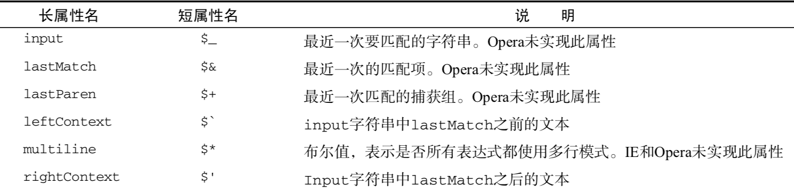
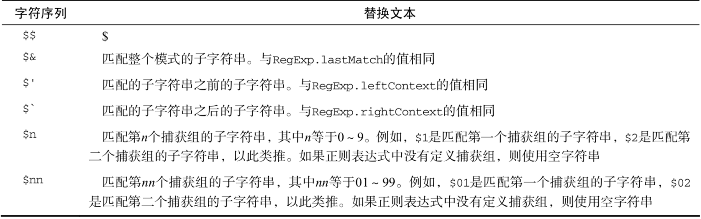

# 引用类型

对象是某个特定引用类型的实例.新对象是使用new操作符后跟一个构造函数来构建的.构造函数本身就是一个函数,只不过该函数是处于创建新对象的目的而定义的

## Object

两种创建对象的方法 一种用new 第二种直接 xx = {x:1} (对象字变量表示法)
>注:通过第二种对象字变量表示法创建的对象是不会调用Object构造函数的

访问属性

```//访问对象中的属性
person['name'];
person.name;
let a = 'name';
person[a]; // 这种和上面的两种 是等价的
```

## Array

创建数组也有两种方式

1. var arr = new Array(); // 括号里写数字表示创建的数字长度; 也可以传递对个字符串参数,表示初试数组中的项

    >注: 在使用 Array构造函数时也可以省略new操作符 即 var name = Array('dra');

2. var name = ['jack', 'lose'];

同上面的Object 第二种方式是不会调用Array构造函数的
**给数组的某个位置设置值,如果该索引大于数组的长度,数组就会自动增加到索引值加1的长度**

数组的length是可变的,即原本数组长度是6, 你将其改为3,那么最后面的3个就会被移除

也可以用arr[arr.length] = 111; // 来动态的给数组尾端添加元素

### 检测是否为数组

用 instanceof 会有一个网页包含多个架构,那么就存在两个以上不同的全局执行环境,从而存在两个以上的不同版本的Array构造函数,所以两个不同框架传递数组就会有各自不同的构造函数.
>为了解决上述问题,es5新增了 `Array.isArray()` 方法来判断到底是不是数组

`arr.unshift(1,2); // 结果是 [1,2] 而不是 [2,1]`

>sort() 排序会给调用每个数组项的toString()方法,然后比较字符串

1,5,10,15 由于'10'的字符串小于'5'的字符串 所以默认的sort()是不合适的,需要在后面传入函数来定义比较的规则

***排序规则: 第一个值位于第二个值之后的应该返回1***

## Date类型

用`new Date()` 里面传入日期 会自动调用 `Date.parse('xx');`  所以`new Date(Date.parse('xx'));` 可以直接简写成 `new Date('xx)`

获取当前时间  es5之后 `Date.now();` 如果不能用这个可以用 `+new Date() // 老写法`

``` 最常用的几个获取方法
let date = new Date(timeStamp * 1000);
let year = date.getFullYear();
let month = date.getMonth() + 1;// 唯一需要注意 这个月份需要加一
let day = date.getDate();
let hour = date.getHours();
let minute = date.getMinutes();
let second = date.getSeconds();
[year, month, day].map(numberFormat).join('/') + ' ' + [hour, minute, second].map(numberFormat).join(':');
function numberFormat(n) {
    n = n.toString();
    return n[1] ? n : '0' + n;
}// 添加前导0
```

## 正则表达式

var expression = /pattern/flag;
flag有如下:

1. g: 全局模式;
2. i: 不区分大小写
3. m: 多行,到行文本末尾还会继续查找下一行是否存在与模式匹配的项

***元字符: 这些出现在正则表达式中都需要转义
`([{\^$|?*+.}])`***

创建正则表达式也有两种方式:

1. var pattern1 = /[bc]at/i;
2. var pattern2 = new RegExp('[bc]at','i');

因为上面第二种  传入的是字符串 对于 **元字符** 需要进行 ***双重转义***
下面举了几个 从字面量模式 转换成字符串  `/\.at/ => "\\.at"; /na\/ag => "na\\/ag"`

上面两个方式创建的正则表达式还是不同的 : 前者共享同一个RegExo实例;后者每次都创建一个新的RegExg实例

```// 两者区别,官方推荐第二种
var re = null,i;
for(i = 0; i < 10; i++){
    re = /cat/g;
    re.test('catdfdere')
}
// 只创建了一个RegExp实例,由于实例属性不会重置,所以再次调用test()方法会失败.第二次查找是从索引为3的地方开始的,然后查到尾端,下一次调用test()有从头开始了
for(i = 0; i < 10; i++){
    re = new RegExp('cat','g');
    re.test('catdfdere')
}
// 第二种每次都会创建新的实例,每次调用test()都会返回true
```

### RegExp实例属性

每个具有下面几个属性:

1. global: g标志(布尔)
2. ignoreCase: 标志(布尔)
3. lastIndex: 开始搜索下一个匹配的字符位置,从0开始(整数)
4. multiline: m标志(布尔)
5. source: 正则表达式字符串表示 (返回的是字面量的字符串)

如 var p = /\[bc\]at/i;
p.global; // fasle;
g.lastIndex; // 0
p.source; // "\[bc\]at"

### RegExp实例方法

1. exec(); //返回的是第一个匹配信息的数组; 没有匹配就返回null; 同时这个数组有额外两个属性: index 和 input(应用该正则表达式的字符串) ; 数组中的第一个项是与整个模式匹配的字符串,其他项是与模式中的**捕获组**匹配的字符串(如果模式中 没有捕获组,那么该数组就一项)

    ``` // test
    var test = 'mom and dad and baby';
    var p = /mom( and dad( and baby)?)?/gi;
    var ma = p.exec(test);
    console.log(ma);
    ["mom and dad and baby", " and dad and baby", " and baby", index: 0, input: "mom and dad and baby", groups: undefined]
    ```

    注: 对于exec()而言,无论模式中设置了全局标志(g),他始终会返回第一个匹配的信息匹配项,唯一与不加不同的是 ,前者第二次调用exec会在第一次的基础上继续查找下一个,后者是每次都重新开始
    let a = xx.exec(pattern); a = xx.exec(pattern;
    // pattern 里面有g那么两个a不同,pattern没g就会一样

2. test() 用来判断是否包含 ,常用在if判断中

### RegExp构造函数属性


可以用长属性名或者短属性名进行访问属性值
`if(pattern.test(xx)) {
    // 这时候 RegExp的各个属性值就会变化
    RegExp.input;// 最近一次匹配的字符串
}`

除了上面几个短属性值 还有其他9个用于存储捕获组的构造函数属性
**`RegExp.$1(可写成RegExp['$1']) ~ RegExp.$9`**, 即使最近用的是test() 这里面也会有值的

### RegExp的局限性

## Function函数

js的**函数是对象**,所以函数名实际上是一个指向函数对象的指针,不会和函数绑定;
**函数名加上括号是调用,如果使用不带圆括号的函数名是访问函数的指针** ;
>个人见解(回调函数可能就是这样,参数传入的是函数名)

js不存在函数的重载

### 函数内部 arguments 和 this

arguments对象还有一个callee的属性, 指向拥有这个arguments对象的函数
在严格模式下会报错

```// 阶乘函数改造
function aa(num) {
    if(num <= 1) {
        return 1;
    } else {
        return num * aa(num - 1);
    }
}
// 使用callee 这样写的好处在于 你如果改变了函数名并不会对内部调用有影响
function aa(num) {
    if(num <= 1) {
        return 1;
    } else {
        return num * arguments.callee(num - 1);
    }
}
// 讲bb指向 aa
var bb = aa;
// aa改变指向
aa = function() {
    return 0
}
// 因为原来的aa用的是.callee 所以即使改变了指向 bb输出的值还是120
alert(aa(5));// 0
alert(bb(5));// 120
```

#### this

**函数对象的caller**可以用来查看调用当前函数的函数的应用,如果是全局的话就是null;

`function outer () {
    inner()
};
function inner() {
    alert(inner.caller)
    // 这里的inner 可以用arguments.callee来替换,为了更好的减少代码的耦合性
};
outer();`  会显示outer()函数的源代码,因为是outer调用了inner(),所以inner.caller就指向了outer()

严格模式下 不能给函数的caller属性进行赋值

#### 函数的属性

每个函数都有两个属性  length  和  prototype ,length属性表示函数希望接收的命名参数的个数

prototype 是特殊的 不可枚举的 用for in无法查到 ,保存了实例方法的真正所在.

### 基本类型的包装

**用 Number() 和 new Number() 创造出来的值是不同的 前者是转型函数,结果值为number;
后者为构造函数,结果值为Object**

#### Number还提供了几个格式化的方法

下面上个方法都遵循四舍五入

1. num.toFixed(2) // 参数规定了返回的小数位数
2. num.toExponential(1) // 返回指数表示法 (1.0e+1) 表示10,参数规定了返回的小数位数
3. num.toPrecision() // 综合是上面的两种,会根据哪种情况合适转换成哪种,参数规定了返回的**数值所有位数(不包括指数位数)**  99.toPrecision(1); // 1e+2 因为99 不能通过一位表示,所以四舍五入100

#### String方法

String类型的每个实例都有一个length属性

chartAt(),和 chartCodeAt() 接收一个参数,基于0 的字符位置; 前者返回给定位置的字符串,后者返回的是字符编码

> 可以使用str[1] 来读取第二个字符 同chartAt(1)

字符串方法

1. concat() 可以传入多个参数
2. slice() ,substring() 在传入正的参数是一样的,当传入负的时候 前者是负的参数加上字符串的长度,后者是 转换为0
3. substr() 第二个参数指返回的参数个数,不传同上面到最后一个字符串, 只有第一个参数为负,也是加上字符串的长度
4. indexOf() lastIndexOf()
5. trim()
6. toLowerCase() toUperCase() 转换大小写的
7. match() 字符串匹配和exec方法相同
8. search() 没找到返回-1
9. replace() 第一个参数可以是正则或者字符串,第二个参数可以是字符串或者函数,;  如果第二个参数是函数,且正则表达式只有一个匹配项,那么会传入三个参数: 模式的匹配项,模式匹配项在字符串的位置和原始字符串;若多个,那么就在第一个和第二个中间插入n个定义的几个捕获组的匹配项
10. split()的第二个参数可以限制获得的数组的长度,若为3 这表示数组长度最长为3
11. localeCompare() 用于比较两个字符串,返回-1,0,1 即字符串排在参数之前,一样和之后
12. formCharCode() 是charCodeAt()的反向

## 单体内置对象

Global 的encodeURI 和encodeURIComponent(), 前者只能转空格 ,后者替换所有非字母数字字符;  所以能对url整体使用前者,但是后者只能使用与URI后面的字符串; **但是更常用的是后者,因为大部分都是对查询字符串进行编码,而不是整个url使用**
