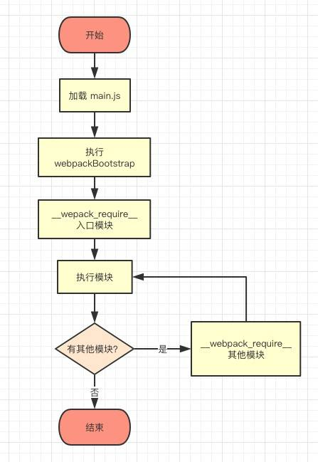

# webpack源码

## 源码地址

[Webpack 是怎样运行的？(一)](https://juejin.cn/post/6844903747508781069)

## 源码分析

入口文件打包后是  一个立即执行函数

```js
(function(modules){
  // ...
})({
  "./src/index.js": (function(){
    // ...
  })
});

// 立即执行函数简化demo
(function (key){console.log(key)})({'ff':'44'}) // 打印 {'ff':'44'}
```



整个文件就是一个立即执行函数,运行了`__webpack_require__`方法,该方法首次传入的参数是入口文件(`__webpack_require__`执行完返回的是`module.exports`)
函数每次首次加载给`installedModules`对象添加对应的模块名,如果第二次加载就导出`installedModules.exports`(exports主要就是记录该模块的所有方法内容)
那么如果是第一次加载 运行模块运行`modules[moduleId].call(module.exports, module, module.exports, __webpack_require__)`(就是运行的modules 对于moduleId key的value的function),运行function时候 如果依赖其他模块那么将模块加载进来通过(加载进行就是再次运行`__webpack_require__`方法,如果内部有的方法外部需要使用就要实现`module.exports`, 即填充`__webpack_require__.d` 其实就是 `Object.defineProperty` 的简单包装),运行完依赖模块后 那么调用该模块的模块拿到他的 `module.exports`值就能完成自己模块后面的内容了

exports的一生


## 异步加载

上面的是将不同的打包进一个main文件里面,会消耗太多网络资源,导致用户等待很久才开始和网络交互
[Webpack 是怎样运行的?（二）](https://zhuanlan.zhihu.com/p/53044886)


