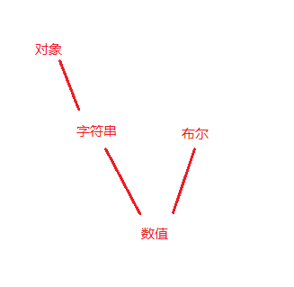

# 隐式转换

## url

[js中的隐式转换](https://www.cnblogs.com/chenmeng0818/p/5954215.html)

## 转换规则

* 隐式转换：
* 对象跟布尔： 对象=》字符=》数字； 布尔 =》 数字
* 对象跟字符串： 对象=》字符
* 对象跟数字： 对象=》字符=》数字
* 字符串跟数字： 字符=》数字
* 字符串跟布尔： 字符=》数字； 布尔 =》 数字
* 布尔跟数字： 布尔 =》 数字

```js
[] == true;  //false  []转换为字符串'',然后转换为数字0,true转换为数字1，所以为false
[1,2,3] == '1,2,3' // true  [1,2,3]转化为'1,2,3'，然后和'1,2,3'， so结果为true;
[1] == 1;  // true  `对象先转换为字符串再转换为数字，二者再比较 [1] => '1' => 1 所以结果为true
'1' == 1 // true
'1' == true; // true
true == 1 // true
// 可以看 剑指的 js各个类型比较大小里面
// 数字跟字符串比较大小
```



## 特殊例子

`[] == false;` // [] 转换成空字符串，之后转换为0， false也为0
`![] == false` // !优先级高于== ,!要先对对象取反，那么就为false
> 只有下面的几个字符取反是true: 空字符串, NaN, 0, null, undefined

```js
undefined == null //true undefined和null 比较返回true，二者和其他值比较返回false
Number(null) //0
```

所以 用 `'' == undefined` 是为`false` ，那么如何为`true`(只有为布尔值的时候才相等)
使用 `!!` 来将两边转换成字符串
`!!'' == !!undefined`

## JavaScript的隐式转换和toString valueof的调用情况

js所有变量都是对象，除了两个例外null 和undefined

```js

//我们先创建一个对象，并修改其toString和valueOf方法
var obj={
    i:10,
    valueOf:function(){
        console.log('执行了valueOf()');
        return this.i+20
    },
    toString:function(){
        console.log('执行了toString()');
        return this.valueOf()+20
    }
}
//当我们调用的时候：
alert( obj )    //50       执行了toString() 执行了valueOf()
alert( +obj )    //30       执行了valueOf()
alert( obj>40 )    //false       执行了valueOf()
alert( obj==30 )    //true       执行了valueOf()
alert( obj===30 )    //false
//最后这个未输出任何字符串，个人猜想是这样的：全等比较时，js解析器直接先判断类型是否一样，明显一个是Object，一个是Number，所以直接不相等，根本不需要再去求值了。
```

那么什么时候调用 `toString`什么时候调用 `valueof`

总结：valueOf偏向于运算，toString偏向于显示。

1、 在进行强转字符串类型时将优先调用toString方法，强转为数字时优先调用valueOf。

2、 在有运算操作符的情况下，valueOf的优先级高于toString。
[深入理解Javascript中的valueOf与toString](https://www.cnblogs.com/bobo-site/p/9945601.html)

另外的总结

无论是一元加号+obj或者是二元的作为字符串拼接的+号，”result”+obj，都会尝试将对象转为字符串，如果valueOf存在，就会先找valueof，若果valueof返回的是基本类型的就会用这个值，如果是个对象就会找toString，如果toString是基本类型，就会用这个，如果是对象，就会报错，cannot convert object to primitive value

只重写了toString，对象转换时会无视valueOf的存在来进行转换。但是，如果只重写了valueOf方法，在要转换为字符串的时候会优先考虑toString方法并会在原型链中去找。在不能调用toString的情况下，只能调用valueOf 方法了。

对于那个奇怪的字符串拼接问题，可能是出于操作符上，翻开ECMA262-5 发现都有一个getValue操作。嗯，那么谜底应该是揭开了。重写会加大它们调用的优化高，而在有操作符的情况下，valueOf的优先级本来就比toString的高。

```js
var aa = {
  i: 10,
  toString: function() {
    console.log('toString');
    return this.i;
  }
}
 
alert(aa);// 10 toString
alert(+aa); // 10 toString
alert(''+aa); // 10 toString
alert(String(aa)); // 10 toString
alert(Number(aa)); // 10 toString
alert(aa == '10'); // true toString

var bb = {
    i: 10,
    valueOf: function() {
        console.log('valueOf');
        return this.i;
    }
 }
 
 alert(bb);// [object Object]
 alert(+bb); // 10 valueOf
 alert(''+bb); // 10 valueOf
 alert(String(bb)); // [object Object]
 alert(Number(bb)); // 10 valueOf
 alert(bb == '10'); // true valueOf

// 发现有点不同吧？！它没有像上面toString那样统一规整。对于那个[object Object]，我估计是从Object那里继承过来的，我们再去掉它看看。
Object.prototype.toString = null;
 
var cc = {
  i: 10,
  valueOf: function() {
    console.log('valueOf');
    return this.i;
  }
}
 
alert(cc);// 10 valueOf
alert(+cc); // 10 valueOf
alert(''+cc); // 10 valueOf
alert(String(cc)); // 10 valueOf
alert(Number(cc)); // 10 valueOf
alert(cc == '10'); // true valueOf
```
