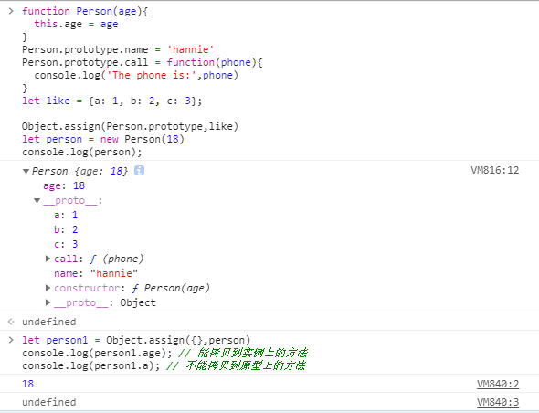

# Object

## Object.create()

[深入剖析Object.create()，为与之相关的理解形成闭环](https://juejin.im/post/6881245501170122759)

### Object.create()和new Object的区别

#### 创建方式不同

`Object.create()`,使用现有的对象来提供新创建的对象的`_proto_`
`Object.create(proto, [propertiesObject])`
`propertiesObjec`：可选。 添加到新创建对象的可枚举属性（即其自身的属性，而不是原型链上的枚举属性）对象的属性描述符以及相应的属性名称。这些属性对应`Object.defineProperties()` 和`Object.defineProperty`的第二个参数。

`new Object()` 方式：通过构造函数来创建对象, 添加的属性是在自身实例下
区别如下：

```js
let a = { fruit : 'apple' }
let b = new Object(a)
// 这里的 b就是a这个实例本身
// 通过构造函数来创建对象, 添加的属性是在自身实例下
// 改变a里面的属性和属性值，b也会跟着变
console.log(b) // {fruit: "apple"}
console.log(b.__proto__) // {}
console.log(b.fruit) // apple

let a = { fruit: 'apple' }
let b = Object.create(a)
// 这里的b是新的空对象
// 继承一个对象, 添加的属性是在原型下
console.log(b)  // {}
console.log(b.__proto__) // {fruit: "apple"}
console.log(b.fruit) // apple

```

#### 创建对象属性描述符不同

`Object.create`用第二个参数创建非空对象的属性描述符默认是为`false`的，不可写,不可枚举,不可配置,要用字面量方法创建

```js
let obj = Object.create({}, { age: { value: 18 } })
console.log(Object.getOwnPropertyDescriptors(obj))

>
{
  age: {
    value: 18,
    writable: false,
    enumerable: false,
    configurable: false
  }
}

// 字面量方法创建的对象属性的描述符默认为true
let obj = Object.create(null)
obj.age = { value: 18 }
console.log(Object.getOwnPropertyDescriptors(obj))


{
  age: {
    value: { value: 18 },
    writable: true,
    enumerable: true,
    configurable: true
  }
}

```

#### 创建空对象时，是否有原型属性不同

类似于第一个

```js
// 打印出一个对象的所有属性和方法
console.dir(new Object()) //{}
>
Object
__proto__:

console.dir(Object.create(null))
>
Object
No properties
```

### 操作原型对象（prototype）的方法

Object.create()的创建方式通过构造函数或者类给对象原型添加属性和方法如下

```js
let Person = function(){}
Person.prototype.age = 18
Person.prototype.name = "hannie"
Person.prototype.show = function() {}
//通过构造函数创建实例
var p = new Person();
console.log(p.__proto__ === Person.prototype) // true
console.dir(p)
>
Person
  __proto__: 
    age: 18
    name: "hannie"
    show: ƒ show()
    __proto__: Object

console.dir(p.__proto__)
>
Object
  age: 18
  name: "hannie"
  show: ƒ show()
  __proto__: Object

```

或者使用es6新推的`Object.setPrototypeOf(object, prototype)`，方法作用同`__proto__`相同，返回参数对象本身。  通过  `Object.getPrototypeOf(object, prototype)`来读取对象的原型内容

```js
let person = {
  age: 18,
  name: "hannie"
};
let o = {sex: 'girl'};
Object.setPrototypeOf(o, person);
console.dir(o)
```

### 原型属性的拷贝（继承）


发现`person1`并没有拷贝到`person`里面的原型内容

可以使用上面介绍的方法

```js
function Person(age){
  this.age = age
}
Person.prototype.name = 'hannie'
Person.prototype.call = function(phone){
  console.log('The phone is:',phone)
}
let like = {a: 1, b: 2, c: 3};

Object.assign(Person.prototype,like)
let person = new Person(18)

let originProto = Object.getPrototypeOf(person);
// 需要获取 里面的get 和set属性以及其他的内容 ，用Object.assign()方法无法正确拷贝get，set属性
let descriptor = Object.getOwnPrototypeDescription(person);
let person1 = Object.create(originProto, descriptor);
```