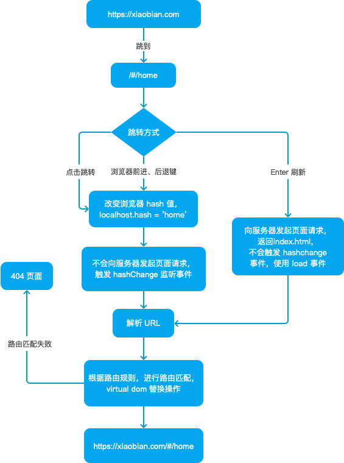

# 路由发展

[路由发展](https://juejin.cn/post/6895882310458343431)

## history.pushState(state, title, URL)

pushState 共接收 3 个参数：

* state：用于存储该 URL 对应的状态对象，可以通过 history.state 获取
* title：标题，目前浏览器并不支持
* URL：定义新的历史 URL 记录，需要注意，新的 URL 必须与当前 URL 同源，不能跨域

pushState 函数会向浏览器的历史记录中添加一条，history.length 的值会 +1，当前浏览器的 URL 变成了新的 URL。需要注意的是：仅仅将浏览器的 URL 变成了新的 URL，页面不会加载、刷新。

通过 history.pushState({ tag: "cart" }, "", "cart.html")，将 /home.html 变成 /cart.html 时，只有 URL 发生了改变，cart.html 页面并没有加载，甚至浏览器都不会去检测该路径是不是存在。这也就是证明了，pushState 在不刷新页面的情况下修改浏览器 URL 链接，单页面路由的实现也就是利用了这一个特性。

细心地童鞋应该发现了，通过 pushState 设置新的 URL 的方法与通过 window.location='#cart' 设置 hash 值改变 URL 的方法有相似之处：URL 都发生了改变，在当前文档内都创建并激活了新的历史记录条目，但页面均没有重新渲染，浏览器没有发起请求。那前者的优势又是什么呢？

* 新的 URL 可以是任意同源的 URL，而 window.location，只能通过改变 hash 值才能保证留在当前 document 中，浏览器不发起请求
* 新的 URL 可以是当前 URL，不改变，就可以创建一条新的历史记录项，而 window.location 必须设置不同的 hash 值，才能创建。假如当前URL为 /home.html#foo，使用 window.location 设置 hash 时，hash值必须不能是 #foo，才能创建新的历史记录
* 可以通过 state 参数在新的历史记录项中添加任何数据，而通过 window.location 改变 hash 的方式，只能将相关的数据转成一个很短的字符串，以 query 的形式放到 hash 值后面
* 虽然 title 参数现在还不能被所有的浏览器支持，前端发展这么快，谁能说的准之后发生的事情呢！
