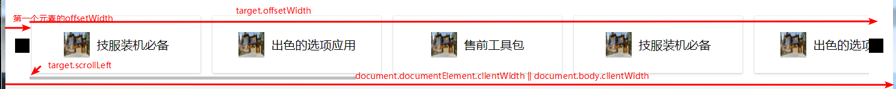

# dom

## event

vue通过方法传入的$event是鼠标的点击位置，clientX是鼠标点击距离页面左边的距离

获取页面的宽度`document.documentElement.clientWidth || document.body.clientWidth`

获取元素的卷入高度
`let scrollTop = document.documentElement.scrollTop || document.body.scrollTop;`

获取指定元素的滚动条距离
`let oList = this.$refs['assemble-list'];`
`oList.scrollLeft`

通过event.target来获取点击的元素的属性
`event.target.offsetLeft` 是距离页面左边的距离（包括滑动即页面滚动了也会算上）
`event.target.clientWidth` 元素宽度

iLeft为当前元素最最左边的元素距离浏览器最左边的距离，通过点击第一个元素获取event.target.offsetLeft来获取
`oList.scrollLeft + iLeft > event.target.offsetLeft` (点击的元素已经被滚动条隐藏（隐藏了部分内容）)

`getBoundingClientRect().top` 据说很强
width,height,left,right,top,bottom
可以获取宽度，高度，左边距离最左边浏览器，右边距离最左边浏览器距离，距离浏览器顶部（会随着滚动条变化而变化）

## demo


首先获取元素（由于上方有文字，需要先找到item

```js
let oList = this.$refs['assemble-list'];
let assembleItem = null;
// 获取元素
if (event.target.className === 'assemble-item') {
    assembleItem = event.target;
} else {
    assembleItem = [...event.path].find(dom => dom.className === 'assemble-item');
}
// 第一个元素距离右边的距离
let iLeft = 44;
let hiddenLeft = oList.scrollLeft + iLeft - assembleItem.offsetLeft;
if (hiddenLeft > 0) {
    this.changeListPage(hiddenLeft);
}
let hiddenRightX = oList.offsetWidth - (assembleItem.offsetLeft - oList.scrollLeft - iLeft);
if (hiddenRightX < 290) {
    this.changeListPage(hiddenRightX - 290);
}
```

## 回到页头/横向滚动

```js
let timer = setInterval(() => {
    let scrollTop = document.documentElement.scrollTop || document.body.scrollTop;
    console.log(window.pageYOffset, document.documentElement.scrollTop, document.body.scrollTop);
    let ispeed = Math.floor(-scrollTop / 3);
    if (scrollTop === 0) {
        clearInterval(timer);
    }
    document.documentElement.scrollTop = document.body.scrollTop = scrollTop + ispeed;
}, 30);

// 左滚和右滚
let timer = setInterval(() => {
    let ispeed = Math.floor(-iCurrentWidth / 4);
    if (ispeed >= 0) {
        if (iCurrentWidth >= 0) {
            clearInterval(timer);
        }
    }
    if (ispeed <= 0) {
        if (iCurrentWidth <= 0) {
            clearInterval(timer);
        }
    }
    oList.scrollBy(ispeed, 0);
    iCurrentWidth = iCurrentWidth + ispeed;
}, 30);
```
