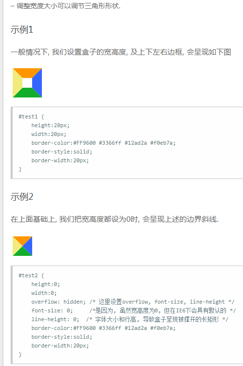

# 开发中搜索的解决方案

## 对于flex为1，但是子内容过多将flex为1的父内容撑大

``` //https://my.oschina.net/u/3407699/blog/1924700/
<div class="wrapper">
    <div class="p1">这个高度固定</div>
    <div class="p2">
        p2的flex为1 即占据所有空余位置
        <div class="p3">p3的内容比p2的总高度还要高导致p2原本是占据空余位置变成超出wrapper的高度</div>
    </div>
</div>
```

此时的解决的办法是：

1. 让p3脱离文旦流，不影响外层flex布局; p2设置相对定位，p3设置绝对定位
2. 设置p2的overflow不为visible,构造BFC

## 首字母大写的方法

<https://www.cnblogs.com/jiangxiaobo/p/6276879.html>

## 获取dom宽和改变宽

$refs['xxx'].clientHeight 获取高度

## blob url

什么是，用途
<https://cloud.tencent.com/developer/ask/98562>
<https://blog.csdn.net/weixin_34409822/article/details/91966486>

## 微信小程序 云开发存储

https://www.bookstack.cn/read/wxcloud-201912/e5f8f8e94d5b04be.md
https://www.w3cschool.cn/weixinapp/weixinapp-8apy2zdi.html

## 获取js时间戳

<https://www.cnblogs.com/deepalley/p/10486714.html>
var timestamp = Date.parse(new Date()); 只精确到秒（1596527205000)
var timestamp = (new Date()).valueOf(); // 1596527205307
var timestamp=new Date().getTime();  //1596527205307

## vue keep-alive使用

<https://www.jianshu.com/p/42429f4d8f9e>

## 两行省略号

<https://www.cnblogs.com/zpsong/p/5406494.html>

```css
{
    text-overflow: -o-ellipsis-lastline;
    overflow: hidden;
    text-overflow: ellipsis;
    display: -webkit-box;
    -webkit-line-clamp: 2;
    -webkit-box-orient: vertical;
}
```

## 两个边框重合

添加样式，这样会导致最右边多出一点点
margin-right: -1px;
margin-bottom: -1px

## 三角形

三角形的原理是


<http://caibaojian.com/css-border-triangle.html>

```css
&:after,&::before {
   border: 1px solid transparent;
   content: ' ';
   height: 0;
   position: absolute;
   width: 0;
}
// 通过一个三角形覆盖另一个三角形出现只带箭头颜色的
&::before {
   border-width: 12px;
   border-bottom-color: #fff ;
   z-index: 10;
   bottom: -1px;
   left: calc(50%);
   transform: translateX(-50%);
}
// 新写法 (transformY 移动部分距离，凑出1px的效果)
&::before {
   border-width: 10px;
   border-bottom-color: #fff ;
   z-index: 10;
   bottom: -1px;
   left: 50%;
   transform: translate(-50%, 3%);
}
&:after {
   border-width: 12px;
   border-bottom-color: #2196F3;
   z-index: 9;
   bottom: 0;
   left: 50%;
   transform: translateX(-50%);
}
```

扩展，画梯形

```css
&::after {
    content: "";
    left: 0;
    bottom: 0;
    right: 0;
    position: absolute;
    display: block;
    height: 0px;
    z-index: 1;
    border-width: 0px var(--left) var(--bottom);
    border-style: none solid solid;
    border-color: transparent transparent #f0f1f5;
}
```

### css filter

filter属性

### vue中$emit $on $off实现组件之间的联动，绝对有你想了解的

vue $off
<https://www.cnblogs.com/kadima-zy/p/emit.html>
