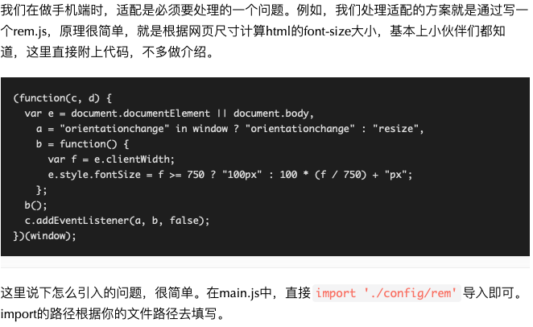
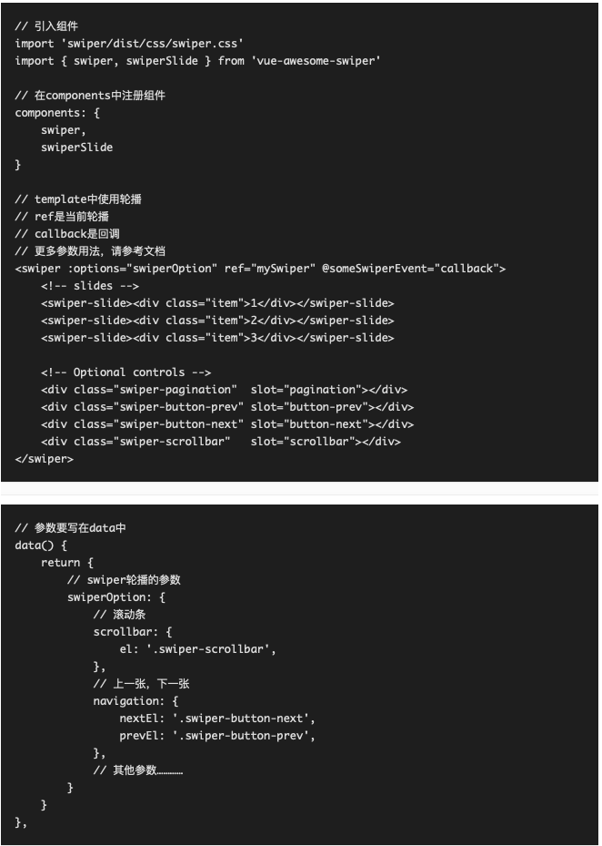
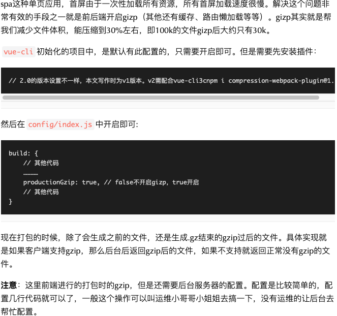
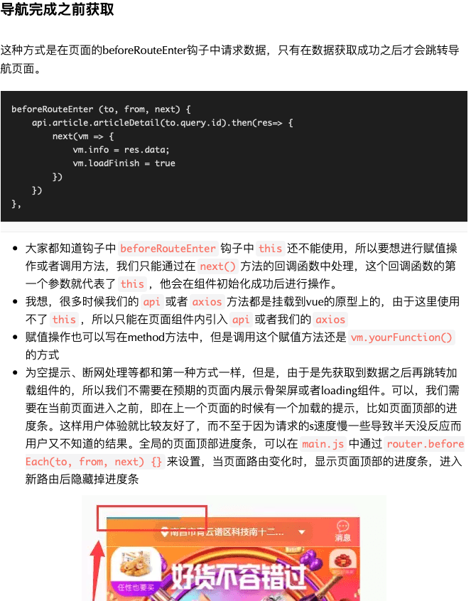
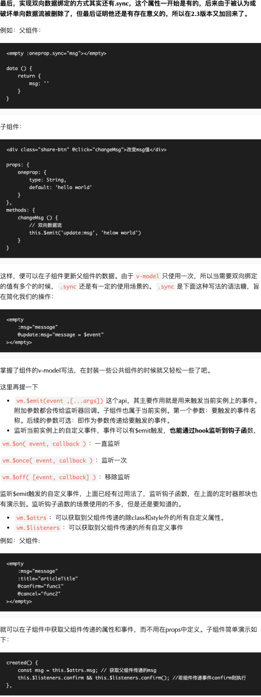
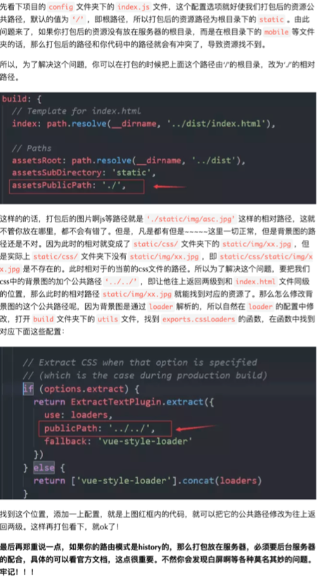

# 关于vue的优化

## 定时器的清除

const timer = setInterval(() =>{
    // 某些定时器操作
}, 500);
// 通过$once来监听定时器，在beforeDestroy钩子可以被清除。
this.$once('hook:beforeDestroy', () => {
    clearInterval(timer);
})

## rem文件导入问题



## 对于轮播图的组件

vue-awesome-swiper 对于elementui如果满足不了可以使用


## 打包生成的.map文件问题

项目打包代码都是经过压缩加密的，如果运行报错是无法知道具体哪里代码报错。 生成.map后缀的文件可以和未加密一样准确输出错误的地方

所以在不是生产环境是不需要.map文件的 在`config/index.js`文件中，设置 `productionSourceMap: false` 就可以不生成.map文件了

vue-cli 3.0 要新建vue.config.js
然后
`module.exports = {
    productionSourceMap: true
}`

## 移动端300ms延迟

因为移动端会有双击放大屏幕的操作，所以点击第一次的时候浏览器会等待300ms后是否点击了第二次， 所以导致普通点击都有300ms延迟

如何解决  那么需要安装  fastClick插件

cnpm install fastclick -S

import FastClick from 'fastclick'; // 引入插件
FastClick.attach(document.body); // 使用 fastclick

## 查看打包后各文件的体积

用vue-cli初始化的项目，会默认安装webpack-bundle-analyzer， 可以查看项目体积结构对比项目中所用到的所有依赖
npm run build --report // 直接运行，然后在浏览器打开http://127.0.0.1:8888/即可查看

## 开启gzip压缩代码



## 对于scope但是又想影响子作用域的css

.parent >>> .child { /* ... */ }
对于less或者sass等预编译，是不支持>>>操作符的
使用/deep/来替换>>>操作符，例如：.parent /deep/ .child { /* ... */ }

## Hiper：一款令人愉悦的性能分析工具

可以输入一个url 会返回从请求到显示页面的各个阶段的加载所需要的时间
cnpm install hiper -g  // 全局安装
hiper baidu.com  //最简单的用法
hiper "baidu.com?a=1&b=2" //如何url中含有任何参数，请使用双引号括起来
...

## 路由的钩子函数



## v-model父子组件详解

`<empty v-model="msg"></empty>`
相当于
`<input type="text" :value="msg" @input="msg = $event.target.value">`

```html
<div class="share-btn" @click="confirm">确定</div>

所以子组件
props: {
    value: {

    }
}
在div定义的xx方法
xx() {
    this.$emit('input',xxx)
}
```

可以使用model选项来避免冲突

```html
model 改进版 一般用这种
<div class="share-btn" @click="confirm" v-model='show'>确定</div>

<script>
    // model选项用来避免冲突
    // prop属性用来指定props属性中的哪个值用来接收父组件v-model传递的值
    // 例如这里用props中的show来接收父组件传递的v-model值
    // event：为了方便理解，可以简单理解为父组件@input的别名，从而避免冲突
    // event的值对应了你emit时要提交的事件名，你可以叫aa，也可以叫bb，但是要命名要有意义哦！！！
    model: {
        prop: 'show',
        event: 'changed'
    }
},
props: {
    // 由于model选项中的prop属性指定了，所以show接收的是父组件v-model传递的值
    show: {
        type: Boolean,
        default: false
    }
},
methods: {
    confirm () {
        // 双向数据绑定父组件传递的值
        // 第一个参数，对应model选项的event的值，你可以叫aa，bbb，ccc，起名随你
        this.$emit('changed', false)
    }
}
</script>
```


就想上面的图一样  :msg.sync 其实也是也哥语法糖
实际是   :msg = 'message' @update:msg = 'message = $event'

## mixins的应用


