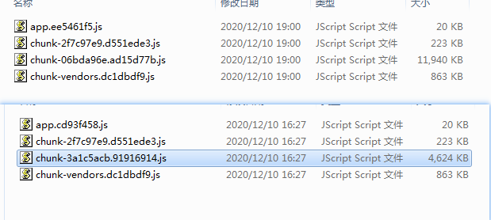
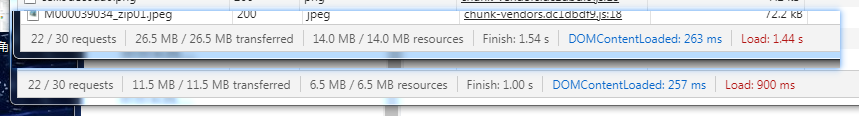
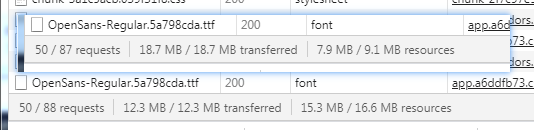

# 静态资源引入

jspdf导出添加静态资源文件
直接使用转化后的base64的json文件

## 原先

直接通过import引入json，然后调用json的各个图片添加进去
效果： 打包时候json打入大js里面，且没有单独的json文件，加载js的时候都加载进去了

## 用require

想着是require在使用的时候才加载，require写在函数里面，调用时候引入
效果： 还是会打入js文件里面

## 后续

将json提取到静态文件夹里面，public里面，然后用 axios导入

```js
async jsonFile(file) {
    let {data} = await axios.get(file);
    return data;
}
if (this.fileJson == null) {
    this.fileJson = await this.jsonFile('pic.json');
}
```

效果: json单独打包，且在导出的时候才会引入图片内容的json文件

优化： 由于图片是有好几个方案的，所以，将json文件再进行细分，即每个不同内容（案例，公司介绍， 以及 1代的案例和3代的案例）
都进行分开，来达到每次引入都引入最少

上图是没有优化的，下图是优化的



