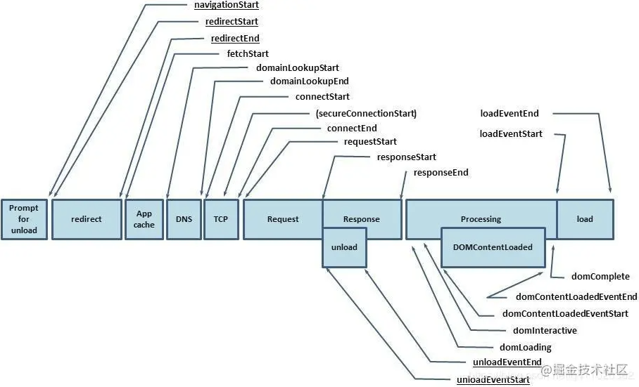

# 新内容

## 目录内容(工程化)

1. Git flow (从代码规范上)
2. 代码自动化部署
3. ts的学习
4. 模块化组件化学习(业务组件, npm 发包)
5. 算法上
6. bff 端的开发
7. ssr 的开发
8. 项目测试上 (如何构建代码测试)
9. react的学习(源码 ui框架  hooks)
10. 用户量大的情况下,对于前端的优化
11. 错误监控提升(包括处理时间的监控)

## Git flow

代码提交

## 代码自动化部署

Jenkins

## 代码自动生成

[若依管理系统](http://vue.ruoyi.vip/tool/gen)

## pv uv

## 错误监控 (扩展: 流量监测)

[什么是ARMS前端监控？](https://help.aliyun.com/document_detail/58652.html?spm=5176.11176313.976547.2.251c6fb7jqPrtm)

[异常埋点](https://www.jianshu.com/p/b357e9a68adb)

## node 内存泄漏

## sessionStorage

[sessionStorage什么时候失效](https://blog.csdn.net/letterTiger/article/details/112581757)

关闭tab或者关闭整个浏览器
但是如果撤销操作还是能够访问到的(原理?)

## vuex和全局变量的区别

1. 使用`vuex`提交数据修改会有记录,可以通过vue-tools查看数据变化
2. 由统一的方法去修改而不是任意修改 (dispatch 触发action ,action去触发mutation)

## 架构

[如何一步步设计前端架构？](https://blog.csdn.net/weixin_44811417/article/details/93079579)

## 业务代码

[业务代码究竟难不难写？](https://www.sohu.com/a/434687127_673711)

> 再来看看文首的问题，你看，虽然只是写业务代码，如果要写的足够好，必须要了解设计模式、理解各种弹力设计、理解事务、熟悉框架、了解中间件原理，怎么可能学不到东西，要实现健壮的业务代码，其实很难，要考虑的东西太多了，如果说写框架我们需要考虑不同的使用方和使用环境，这很难，写业务代码我们要考虑到千奇百怪的使用行为，要考虑到层次不起的对接方，这不比写框架简单。对于5年+经验丰富的程序员应当有能力开一个好头，或者说愿意在老代码上去做一些改变，否则你的价值在哪里呢？

## 前端 架构设计

[前端架构设计的方法论](https://segmentfault.com/a/1190000016873522)

## requestAnimationFrame (分片优化渲染)

1. 请求动画帧 由系统绘制率(浏览器刷新频率)决定 (60Hz 1000/60 = 16.7ms)
2. 会把每一帧的所有dom操作集中起来(再一次重绘或回流中完成)
3. 隐藏或者不可见的元素不会重绘或回流

[什么是requestAnimationFrame](https://zhuanlan.zhihu.com/p/171612962)
[requestAnimationFrame详解](https://www.jianshu.com/p/fa5512dfb4f5)
挂载在window上的方法.

**它能保证回调函数在屏幕每一次的绘制间隔中只被执行一次, 这样就不会引起丢帧现象，也不会导致动画出现卡顿的问题。**

跟`setTImeout`相比

1. 时间较为固定,不会造成动画的卡顿

## 渲染

[渲染大量数据显示的优化](https://blog.csdn.net/alnorthword/article/details/87935038)

主要问题

1. 按照原来的做法，普通的组件，进行数据渲染插入dom中（几十条邹游），数据量小的时候很正常，vue很快。
2. 改为分段实现，把一批数据进行分块，通过定时器取出相应的部分去渲染，这种做法，比第一中稍微好点
3. 改为分段+虚拟DOM实现，这种做法，当达到几百条就会出现问题。

解决思路

1. 不要渲染全部数据，只渲染用户眼睛能看到的部分数据。
2. 不要用Vue去管理和监听全部的数据，造成很大的内存开销，可以自己定义个变量计算。

### 大数据处理

前端分片优化渲染
[前端页面如何正确渲染大量数据](https://blog.csdn.net/yy168888/article/details/115660601?utm_medium=distribute.pc_relevant.none-task-blog-2%7Edefault%7EBlogCommendFromMachineLearnPai2%7Edefault-3.control&depth_1-utm_source=distribute.pc_relevant.none-task-blog-2%7Edefault%7EBlogCommendFromMachineLearnPai2%7Edefault-3.control)

### 微任务 queueMicrotask

宏任务 macro-task;

## 千分位

## 前端设置页面缓存

[实践这一次，彻底搞懂浏览器缓存机制](https://segmentfault.com/a/1190000017962411)
[前端缓存最佳实践](https://juejin.cn/post/6844903737538920462)

## queueMicrotask

## chrome控制台

[【干货】【建议收藏】chrome开发者工具最常见的使用方式](https://blog.csdn.net/qq_38164763/article/details/105464755)

## 技术架构

技术架构
前端架构选型
架构设计

## 前端架构:从入门到微前端 pdf (还没有获取)

[读书笔记 前端架构：从入门到微前端](https://www.yuque.com/shenyangdong/kb/zcvox9)

## 多端异构

## 小程序框架原理(Mpvue)

## 动画 canvas(旋转) svg

## 富文本编辑框

## bff (Backend for frontend)

服务于前端的后端(逻辑分层,而非技术)
BFF调用后端的rpc，BFF给前端提供http

[什么是RPC？](https://www.jianshu.com/p/7d6853140e13)

1. rpc (remote Procedure Call)远程调用过程 ,理解成一个节点调用另外一个节点提供的服务
2. 本地调用 调用本地的函数
3. 远程调用 方法在服务端,通过调用接口

serverless

## api网关 (需要统一的 RESTful api)

作为所有客户端访问服务器的唯一入口

## vue-loader (写个vue的编译器)

webpack 如何提取vue中的标签
vue的style标签如何提取
[关于Vue-loader的那些事儿](https://www.cnblogs.com/Indomite/p/13256530.html)

## ivew

[iVew](https://iview.github.io/docs/guide/install)

## index db

[HTML5 indexedDB前端本地存储数据库实例教程](https://www.zhangxinxu.com/wordpress/2017/07/html5-indexeddb-js-example/)

## 高阶组件

[Vue 进阶必学之高阶组件 HOC](https://zhuanlan.zhihu.com/p/126552443)

## 组件

### vue组件

[封装Vue组件的一些技巧](https://juejin.cn/post/6844903821513064456) // 必看 封装组件

### 组件库搭建

[每个前端都值得拥有自己的组件库，就像每个夏天都拥有西瓜](https://juejin.cn/post/6983854006124675108#heading-0) // 必看 然后也看看这个作者

### 组件库

[Element-UI 技术揭秘（2）- 组件库的整体设计](https://juejin.cn/post/6844903925632466951) // 必看
[Element源码分析系列3-Button(按钮)](https://juejin.cn/post/6844903661127237639) // 必看
[怎么学习Element-ui的源码?](https://www.zhihu.com/question/60706223) // 必看

## 前端难点

[前端开发的难点到底在什么地方?](https://www.zhihu.com/question/275915023)

## 工程化建设

应用脚手架;业务组件;创建解决方案,sdk (软件开发工具包: 类似api,但是提供了某一项功能)
[前端工程化建设](https://zhuanlan.zhihu.com/p/117486284) 必看, 后续可以详细看,里面有各个内容的推荐链接

1. 规范:团队规范,代码规范,ui规范,项目结构规范,git commit 规范
2. 性能优化: 代码优化,非代码优化
3. 测试
4. 构建部署 (这步我还缺失) Jenkins,Docker
5. 性能和错误监控

[if 我是前端团队 Leader，怎么制定前端协作规范?](https://juejin.cn/post/6844903897610321934) // 必读 必看,将代码规范,隶属于第一栏里面的内容

[前端架构有哪些核心问题？](https://zhuanlan.zhihu.com/p/192640184)
[前端架构，前端工程化](https://blog.csdn.net/qq_33150267/article/details/79213054)
[浅谈前端架构的工程化、模块化、组件化、规范化](https://blog.csdn.net/qq_42068550/article/details/93333487) 概念上的表述
[前端工程化实践：大前端的转变之路](https://zhuanlan.zhihu.com/p/28769103)
[有哪些值得关注学习的使用TypeScript的开源项目？](https://www.zhihu.com/question/54460468)
[TypeScript 优秀开源项目大合集](https://www.cnblogs.com/brookshi/p/6505599.html)
[2021年如何从零创建一个TypeScript项目](https://www.wangwl.net/static/pages/starting_ts_project.html) // 必看 `esbuild`

搜索关键词: 工程化建设
[工程化](https://juejin.cn/search?query=%E5%B7%A5%E7%A8%8B%E5%8C%96) // 必看 掘金搜索
[手把手带你入门前端工程化——超详细教程](https://juejin.cn/post/6892003555818143752) // 必看
技术选型 (选人多,ui框架也是)
统一规范:
 代码规范(促进团队合作,降低维护成本,帮助code review,养成规范习惯)
 推荐了几个代码规范的库 [airbnb/javascript](https://github.com/airbnb/javascript)
 (react,style命名(参考BEM), CSS-in-JavaScript)
 > 注: BEM就是名字太长了, 但是规范性好,用在公共组件或者公共样式可以这么写
git规范: 分支管理,commit规范
项目规范: 文件名以及文件置放位置
测试: 单元测试;TDD(测试驱动开发,不好点在于需求如果经常变动)
部署: webhook, 自动化部署 // 必看
监控:
 性能监控(这边讲的比较多) // 必看
 错误监控 (`window.requestIdleCallback` 页面加载完后)
用户信息收集(页面停留时间)
 前端监控部署教程 // 必看
性能优化
重构

### 性能监控

另外一篇文章
[最全的前端性能定位总结](https://mp.weixin.qq.com/s/0Sg7-2MKzXcLX4deCr7TMA) // 必看
下面内容是接 [工程化建设-手把手带你入门](#工程化建设)
性能监控一般利用 `window.performance` 来进行数据采集



```js
timing: {
 // 同一个浏览器上一个页面卸载(unload)结束时的时间戳。如果没有上一个页面，这个值会和fetchStart相同。
 navigationStart: 1543806782096,

 // 上一个页面unload事件抛出时的时间戳。如果没有上一个页面，这个值会返回0。
 unloadEventStart: 1543806782523,

 // 和 unloadEventStart 相对应，unload事件处理完成时的时间戳。如果没有上一个页面,这个值会返回0。
 unloadEventEnd: 1543806782523,

 // 第一个HTTP重定向开始时的时间戳。如果没有重定向，或者重定向中的一个不同源，这个值会返回0。
 redirectStart: 0,

 // 最后一个HTTP重定向完成时（也就是说是HTTP响应的最后一个比特直接被收到的时间）的时间戳。
 // 如果没有重定向，或者重定向中的一个不同源，这个值会返回0. 
 redirectEnd: 0,

 // 浏览器准备好使用HTTP请求来获取(fetch)文档的时间戳。这个时间点会在检查任何应用缓存之前。
 fetchStart: 1543806782096,

 // DNS 域名查询开始的UNIX时间戳。
        //如果使用了持续连接(persistent connection)，或者这个信息存储到了缓存或者本地资源上，这个值将和fetchStart一致。
 domainLookupStart: 1543806782096,

 // DNS 域名查询完成的时间.
 //如果使用了本地缓存（即无 DNS 查询）或持久连接，则与 fetchStart 值相等
 domainLookupEnd: 1543806782096,

 // HTTP（TCP） 域名查询结束的时间戳。
        //如果使用了持续连接(persistent connection)，或者这个信息存储到了缓存或者本地资源上，这个值将和 fetchStart一致。
 connectStart: 1543806782099,

 // HTTP（TCP） 返回浏览器与服务器之间的连接建立时的时间戳。
        // 如果建立的是持久连接，则返回值等同于fetchStart属性的值。连接建立指的是所有握手和认证过程全部结束。
 connectEnd: 1543806782227,

 // HTTPS 返回浏览器与服务器开始安全链接的握手时的时间戳。如果当前网页不要求安全连接，则返回0。
 secureConnectionStart: 1543806782162,

 // 返回浏览器向服务器发出HTTP请求时（或开始读取本地缓存时）的时间戳。
 requestStart: 1543806782241,

 // 返回浏览器从服务器收到（或从本地缓存读取）第一个字节时的时间戳。
        //如果传输层在开始请求之后失败并且连接被重开，该属性将会被数制成新的请求的相对应的发起时间。
 responseStart: 1543806782516,

 // 返回浏览器从服务器收到（或从本地缓存读取，或从本地资源读取）最后一个字节时
        //（如果在此之前HTTP连接已经关闭，则返回关闭时）的时间戳。
 responseEnd: 1543806782537,

 // 当前网页DOM结构开始解析时（即Document.readyState属性变为“loading”、相应的 readystatechange事件触发时）的时间戳。
 domLoading: 1543806782573,

 // 当前网页DOM结构结束解析、开始加载内嵌资源时（即Document.readyState属性变为“interactive”、相应的readystatechange事件触发时）的时间戳。
 domInteractive: 1543806783203,

 // 当解析器发送DOMContentLoaded 事件，即所有需要被执行的脚本已经被解析时的时间戳。
 domContentLoadedEventStart: 1543806783203,

 // 当所有需要立即执行的脚本已经被执行（不论执行顺序）时的时间戳。
 domContentLoadedEventEnd: 1543806783216,

 // 当前文档解析完成，即Document.readyState 变为 'complete'且相对应的readystatechange 被触发时的时间戳
 domComplete: 1543806783796,

 // load事件被发送时的时间戳。如果这个事件还未被发送，它的值将会是0。
 loadEventStart: 1543806783796,

 // 当load事件结束，即加载事件完成时的时间戳。如果这个事件还未被发送，或者尚未完成，它的值将会是0.
 loadEventEnd: 1543806783802
}

```

```js
// 重定向耗时
redirect: timing.redirectEnd - timing.redirectStart,
// DOM 渲染耗时
dom: timing.domComplete - timing.domLoading,
// 页面加载耗时
load: timing.loadEventEnd - timing.navigationStart,
// 页面卸载耗时
unload: timing.unloadEventEnd - timing.unloadEventStart,
// 请求耗时
request: timing.responseEnd - timing.requestStart,
// 获取性能信息时当前时间
time: new Date().getTime(),

```

白屏时间 ,放到 `<head/>` 前

```html
<script>
    whiteScreen = new Date() - performance.timing.navigationStart
</script>
```

### BEM

[CSS — BEM 命名规范](https://juejin.cn/post/6844903672162304013)

```jsx

<div class="article">
    // 两个下划线表示 父和子两个块之间的连接
    <div class="article__body">
        <div class="tag"></div>
        // -- 表示不同的状态 (button不同的状态)
        <button class="article__button--primary"></button>
        <button class="article__button--success"></button>
    </div>
</div>

// sass 写法
.article {
    max-width: 1200px;
    &__body {
        padding: 20px;
    }
    &__button {
        padding: 5px 8px;
        &--primary {background: blue;}
        &--success {background: green;}
    }
}

```

## 知识点

1. Module Federation(模块联邦)
2. Web Components (微组件)
3. bash脚本

[Module Federation](https://zhuanlan.zhihu.com/p/141390589)
[Web Components 入门实例教程](https://www.ruanyifeng.com/blog/2019/08/web_components.html)

## 知识小点

figcaption

## 微服务

微应用、微组件、微模块

模块联邦是可选的，如果实现了，服务粒度就是微模块；而如果没有实现，服务粒度就是微应用。

[微前端解决方案](https://segmentfault.com/a/1190000040275586)
[再谈微前端](https://zhuanlan.zhihu.com/p/234964127)
[react错误监测](https://mp.weixin.qq.com/s/yw-4sgnLz1DLxlYqedqg_Q)
[es修饰器](https://es6.ruanyifeng.com/#docs/decorator)

## 下一个阶段准备内容

[学习计划](https://jcmpd975ac.feishu.cn/base/appNuDKPaGtimrdkB0JnXmpoktZ?table=tblhwIrxYTiY1SSP&view=vew9iquA45)
[大厂面试题每日一题](https://q.shanyue.tech/)

## 前端体系

关键字搜索 前端体系
关键字搜索 大前端
关键字搜索 web 总体框架设计
[前端技术体系大局观](https://zhuanlan.zhihu.com/p/23185351) // 必读,可以按照这个建立自己的知识体系

## 业务性能优化

关键字搜索 js 业务开发性能问题

[Web业务性能优化技术总结](https://blog.csdn.net/horkychen/article/details/63033913) // 带来一些思考

## js执行原理

[JavaScript的执行原理](https://blog.csdn.net/GY_U_YG/article/details/72869315)
webkit的渲染过程
event looper

## 指令

ga . // zsh

## 概念内容

DDD [https://juejin.cn/post/6844903997678026760](https://juejin.cn/post/6844903997678026760)
SOA [SOA](https://baike.baidu.com/item/SOA/2140650)
RPC [写给自己的 SOA 和 RPC 理解](https://www.cnblogs.com/java-class/p/10653404.html)
PWA 渐进式Web应用开发

## 架构的技术选型

[资深前端架构师对于框架的技术选型](https://zhuanlan.zhihu.com/p/81461207)

## 算法

### 准备

[前端该如何准备数据结构和算法？](https://juejin.cn/post/6844903919722692621) // 必读
[用JavaScript实现的算法和数据结构](http://www.conardli.top/docs/) // 必读

### js数据结构与算法

[你可能知道的 javaScript 数据结构与算法](https://github.com/sunzhaoye/blog/issues/19)

### 排序算法

[前端常见算法的JS实现](https://segmentfault.com/a/1190000008593715)
[二叉树——前序遍历、中序遍历、后序遍历、层序遍历详解(递归非递归)](https://www.cnblogs.com/bigsai/p/11393609.html)

## 手写代码

[最全的手写JS面试题](https://juejin.cn/post/6968713283884974088)

## webpack

[「一劳永逸」由浅入深配置webpack4](https://juejin.cn/post/6859888538004783118) // 必看
各种loader介绍
各种plugin介绍
然后webpack 高级概念
[编写一个loader](https://www.webpackjs.com/contribute/writing-a-loader/#%E7%AE%80%E5%8D%95%E7%94%A8%E6%B3%95)

### webpack 内部原理

[webpack内部机制](https://juejin.cn/post/6872590966466576397) // 必看

[webpack打包原理 ? 看完这篇你就懂了 !](https://zhuanlan.zhihu.com/p/101541041)

### webpack 热更新

搜索关键词 webpack热更新原理
[轻松理解webpack热更新原理](https://blog.csdn.net/chern1992/article/details/106893227) // 必看
[简单了解webpack热更新原理](https://zhuanlan.zhihu.com/p/222582852)

## 面试

### 基础

[2万字 | 前端基础拾遗90问](https://juejin.cn/post/6844904116552990727) // 必看 面试

### vue面试题 (入门到精通,原理)

[30 道 Vue 面试题，内含详细讲解（涵盖入门到精通，自测 Vue 掌握程度）](https://juejin.cn/post/6844903918753808398) // 必看
[让你30分钟快速掌握vue 3](https://juejin.cn/post/6887359442354962445) // vue3 必看
搜索关键字  vue 长列表性能优化
[Vue 项目性能优化 — 实践指南（网上最全 / 详细）](https://juejin.cn/post/6844903913410314247)

### vue源码查看

[Vue源码学习笔记](https://github.com/LaoChen1994/Essays/tree/master/vue/source_code_learn)
[Vue3.x源码调试](https://juejin.cn/post/6844903957836333069)

## ts开源内容

[有哪些值得关注学习的使用TypeScript的开源项目？](https://www.zhihu.com/question/54460468)
[TypeScript 优秀开源项目大合集](https://www.cnblogs.com/brookshi/p/6505599.html)

### ts封装

[ts封装ajax](https://blog.csdn.net/qq_42235030/article/details/110787015)

## 搜索

compiler.hooks.done // webpack内容
