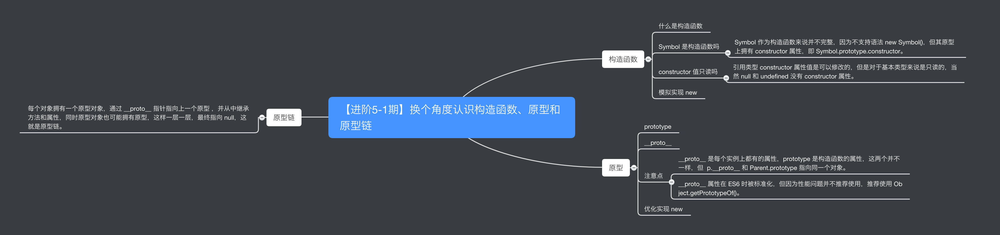
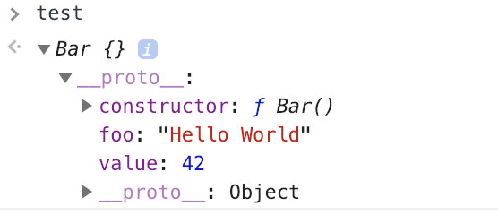
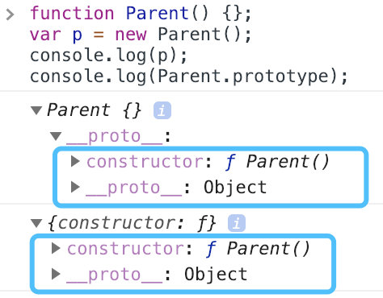
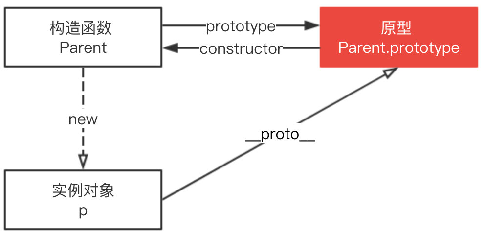

# 重新认识构造函数、原型和原型链

<https://github.com/yygmind/blog/issues/32>



## 构造函数

### Symbol 是构造函数吗

Symbol 是基本数据类型，但作为构造函数来说它并不完整，因为它不支持语法 new Symbol()，Chrome 认为其不是构造函数，如果要**生成实例直接使用 Symbol()** 即可。

~~~创建symbol
new Symbol(123); // Symbol is not a constructor
Symbol(123); // Symbol(123)
let sym = Symbol(123);
// 虽然是基本数据类型,但是可以获取constructor属性值
console.log( sym.constructor );// ƒ Symbol() { [native code] }
~~~

### constructor 值只读吗

这个得分情况，对于**引用类型**来说 constructor 属性值是可以修改的，但是对于**基本类型**来说是只读的。

引用类型情况其值可修改这个很好理解，比如**原型链继承方案中，就需要对 constructor重新赋值进行修正**。

~~~修改constructor
function Foo() {
    this.value = 42;
}
Foo.prototype = {
    method: function() {}
};

function Bar() {}

// 设置 Bar 的 prototype 属性为 Foo 的实例对象
Bar.prototype = new Foo();
Bar.prototype.foo = 'Hello World';

Bar.prototype.constructor === Object;
// true

// 修正 Bar.prototype.constructor 为 Bar 本身
Bar.prototype.constructor = Bar;

var test = new Bar() // 创建 Bar 的一个新实例
console.log(test);
~~~



**注下面是几种普通类型的constructor属性,然 null 和 undefined 是没有 constructor 属性的。**

```// 其他几种类型的constructor
function Type() { };
var types = [1, "muyiy", true, Symbol(123)];

for(var i = 0; i < types.length; i++) {
    types[i].constructor = Type;
    types[i] = [ types[i].constructor, types[i] instanceof Type, types[i].toString() ];
};

console.log( types.join("\n") );
// function Number() { [native code] }, false, 1
// function String() { [native code] }, false, muyiy
// function Boolean() { [native code] }, false, true
// function Symbol() { [native code] }, false, Symbol(123)

```

***上述造成原因: 因为创建他们的是只读的原生构造函数（native constructors），这个例子也说明了依赖一个对象的 constructor 属性并不安全。***

### 模拟实现new

```new的实现
function create() {
    // 1、创建一个空的对象
    var obj = new Object(),
    // 2、获得构造函数，同时删除 arguments 中第一个参数
    Con = [].shift.call(arguments);
    // 3、链接到原型，obj 可以访问构造函数原型中的属性
    Object.setPrototypeOf(obj, Con.prototype);
    // 4、绑定 this 实现继承，obj 可以访问到构造函数中的属性
    var ret = Con.apply(obj, arguments);
    // 5、优先返回构造函数返回的对象
    return ret instanceof Object ? ret : obj;
};
```

## 原型


上图可以看出 Parent 对象有一个原型对象 Parent.prototype，其上有两个属性，分别是 constructor 和 __proto__，其中 __proto__ 已被弃用。

构造函数 Parent 有一个指向原型的指针，原型 Parent.prototype 有一个指向构造函数的指针 Parent.prototype.constructor，如上图所示，其实就是一个循环引用。


### `__proto__`

上图可以看到 Parent 原型（ Parent.prototype ）上有 `__proto__` 属性，这是一个访问器属性（即 getter 函数和 setter 函数），通过它可以访问到对象的内部 [[Prototype]] (一个对象或 null )。

`__proto__` 发音 dunder proto，最先被 Firefox使用，后来在 ES6 被列为 Javascript 的标准内建属性。

[[Prototype]] 是对象的一个内部属性，外部代码无法直接访问。

```function Parent(){};var p = new Parent();console.log(p,Parent.prototype)```

这里用 `p.__proto__` 获取对象的原型，`__proto__` 是每个实例上都有的属性，prototype 是构造函数的属性，这两个并不一样，但 `p.__proto__` 和 `Parent.prototype` 指向同一个对象。
**所以构造函数 Parent、Parent.prototype 和 p 的关系如下图。**


**注意点
`__proto__` 属性在 ES6 时才被标准化，以确保 Web 浏览器的兼容性，但是不推荐使用，除了标准化的原因之外还有性能问题。为了更好的支持，推荐使用 `Object.getPrototypeOf()`。**

如果要读取或修改对象的 [[Prototype]] 属性，建议使用如下方案，但是此时设置对象的 [[Prototype]] 依旧是一个缓慢的操作，如果性能是一个问题，就要避免这种操作。

```修改
Object.getPrototypeOf()
Reflect.getPrototypeOf()

// 修改
Object.setPrototypeOf()
Reflect.setPrototypeOf()
```

如果要创建一个新对象，同时继承另一个对象的 [[Prototype]] ，推荐使用 Object.create()。

```创建对象
function Parent() {
    age: 50
};
var p = new Parent();
var child = Object.create(p);
```

这里 child 是一个新的空对象，有一个指向对象 p 的指针 `__proto__`。

### 优化实现new

不建议使用`__proto__`,所以使用`Object.create()`来模拟使用,优化后的代码如下:

```// new功能的实现
function create() {
    // 1、获得构造函数，同时删除 arguments 中第一个参数
    Con = [].shift.call(arguments);
    // 2、创建一个空的对象并链接到原型，obj 可以访问构造函数原型中的属性
    var obj = Object.create(Con.prototype);
    // 3、绑定 this 实现继承，obj 可以访问到构造函数中的属性
    var ret = Con.apply(obj, arguments);
    // 4、优先返回构造函数返回的对象
    return ret instanceof Object ? ret : obj;
};
```

## 原型链

每个对象拥有一个原型对象，通过 `__proto__` 指针指向上一个原型 ，并从中继承方法和属性，同时原型对象也可能拥有原型，这样一层一层，最终指向 null。这种关系被称为原型链 (prototype chain)，通过原型链一个对象会拥有定义在其他对象中的属性和方法。

``` // p实例是不存在constructor属性的
function Parent(age) {
    this.age = age;
}

var p = new Parent(50);
p.constructor === Parent; // true
// 可以打印p p里没有constructor属性
// 为什么会有constructor属性,是通过原型链向上查找__proto__,最终查到constructor属性,该属性指向Parent

p;  // Parent {age: 50}
p.__proto__ === Parent.prototype; // true
p.__proto__.__proto__ === Object.prototype; // true
p.__proto__.__proto__.__proto__ === null; // true
```


下图展示了原型链的运作机制


## 总结

* Symbol 作为构造函数来说并不完整，因为不支持语法 `new Symbol()`，但其原型上拥有 `constructor` 属性，即 `Symbol.prototype.constructor`。
* 引用类型 constructor 属性值是可以修改的，但是对于基本类型来说是只读的，当然 null 和 undefined 没有 constructor 属性。
* `__proto__` 是每个实例上都有的属性，`prototype` 是构造函数的属性，这两个并不一样，但 `p.__proto__` 和 `Parent.prototype` 指向同一个对象。
* `__proto__` 属性在 ES6 时被标准化，但因为性能问题并不推荐使用，推荐使用 `Object.getPrototypeOf()`。
* 每个对象拥有一个原型对象，通过 `__proto__` 指针指向上一个原型 ，并从中继承方法和属性，同时原型对象也可能拥有原型，这样一层一层，最终指向 null，这就是原型链。