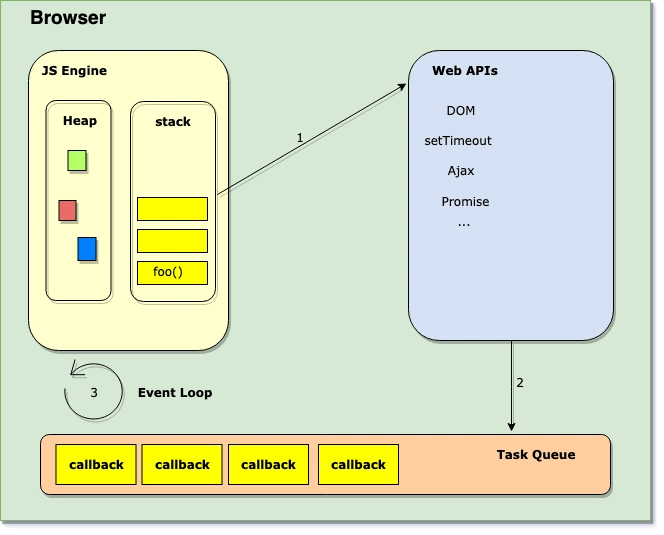

# Event Loop

<https://juejin.im/post/5d4d64d1e51d4561ff6667de>
浏览器是提供运行时环境来给我们执行JS代码的。浏览器的主要组成包括有调用堆栈，事件循环，任务队列和WEB API。像什么常用的定时器setTimeout，setInterval这些全局函数就不是JavaScript的一部分，而是WEB API给我们提供的。

事件循环(Event loop)不断地监视任务队列(Task Queue)，并按它们排队的顺序一次处理一个回调。每当调用堆栈(call stack)为空时，Event loop获取回调并将其放入堆栈(stack )(箭头3)中进行处理。请记住，如果调用堆栈不是空的，则事件循环不会将任何回调推入堆栈。

JavaScript中是可以有宏认为和微任务的，比如说setTimeout回调是宏任务，而Promise回调是微任务。

宏任务在单个循环周期中一次一个低堆入堆栈，但是微任务队列总是在执行后返回到事件之前清空。所以，如果你以处理条目的速度向这个队列添加条目，那么你就永远在处理微任务。只有当微任务队列为空时，事件循环才会重新渲染页面。
https://zhuanlan.zhihu.com/p/33058983

额外一提：堆里存放着一些对象。而栈中则存放着一些基础类型变量以及对象的指
上面的调用堆栈(执行栈)和这个栈的意义却有些不同
