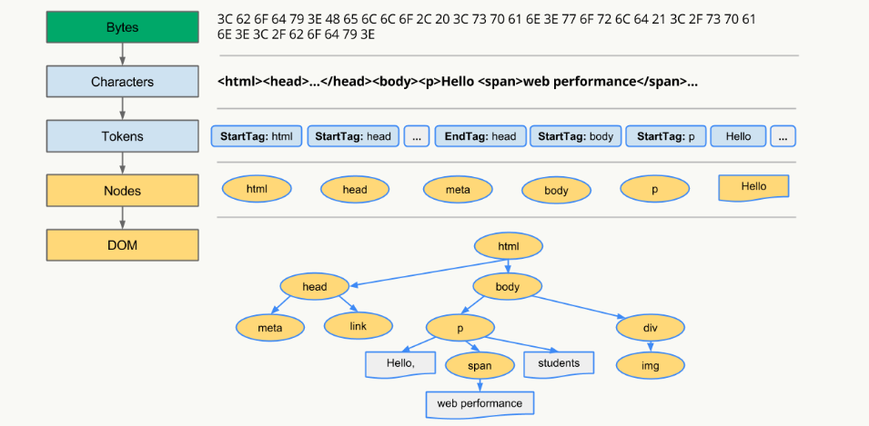

# 浏览器原理

[11道浏览器原理面试题](https://juejin.im/post/5d89798d6fb9a06b102769b1)

## 常见的浏览器内核有哪些

## 浏览器的主要组成部分是什么

## 浏览器是如何渲染UI的

1. 对html解析生成dom tree
2. 同时解析css生成 style rules
3. 合并成render tree 之后
4. 进入布局阶段（layout）即屏幕上确切的坐标，后面
5. 调用GPU进行绘制（Paint）,即遍历render tree 节点呈现页面元素

## 浏览器如何解析css选择器

从右到左

## DOM Tree是如何构建的

转码: 浏览器将接收到的二进制数据按照指定编码格式转化为HTML字符串
生成Tokens: 之后开始parser，浏览器会将HTML字符串解析成Tokens
构建Nodes: 对Node添加特定的属性，通过指针确定 Node 的父、子、兄弟关系和所属 treeScope
生成DOM Tree: 通过node包含的指针确定的关系构建出DOM Tree

## 浏览器重绘与重排的区别

重排: render tree  部分或全部渲染树重新分析并且节点尺寸重新计算，生成新的布局layout，重新排列元素
重绘: 元素几何属性或者样式变化(背景色)，主要表现为外观变化

重排后会重新绘制受到这次重排影响的内容

所以 重排必会引起重绘

## 如何触发重排和重绘

通过display: none隐藏一个DOM节点-触发重排和重绘
通过visibility: hidden隐藏一个DOM节点-只触发重绘，因为没有几何变化

## 如何避免重绘或者重排

1. 集中改变样式
2. documentFragment（即创建一个容器，将要改变的元素都在这里面改变，之后再插入dom树中
`var fragment = document.createDocumentFragment();`

## 前端如何实现即时通讯

## 同源策略

script、img 和link 不受限制
