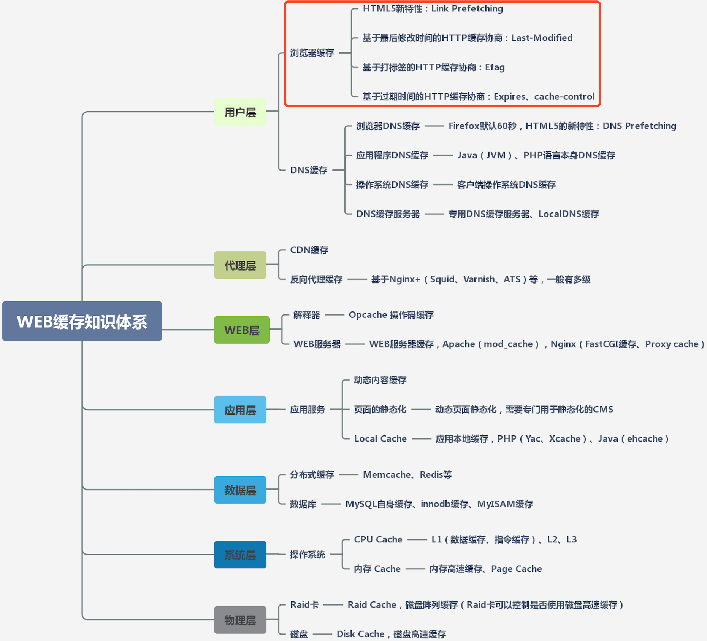

# 浏览器缓存机制

## 深入理解浏览器的缓存机制

<https://www.jianshu.com/p/54cc04190252>

### 缓存位置

Service Worker
Memory Cache
Disk Cache
Push Cache

### 浏览器缓存策略： 强缓存和协商缓存

## 前端优化：浏览器缓存技术介绍

<https://www.jianshu.com/p/7531c98a6933>

