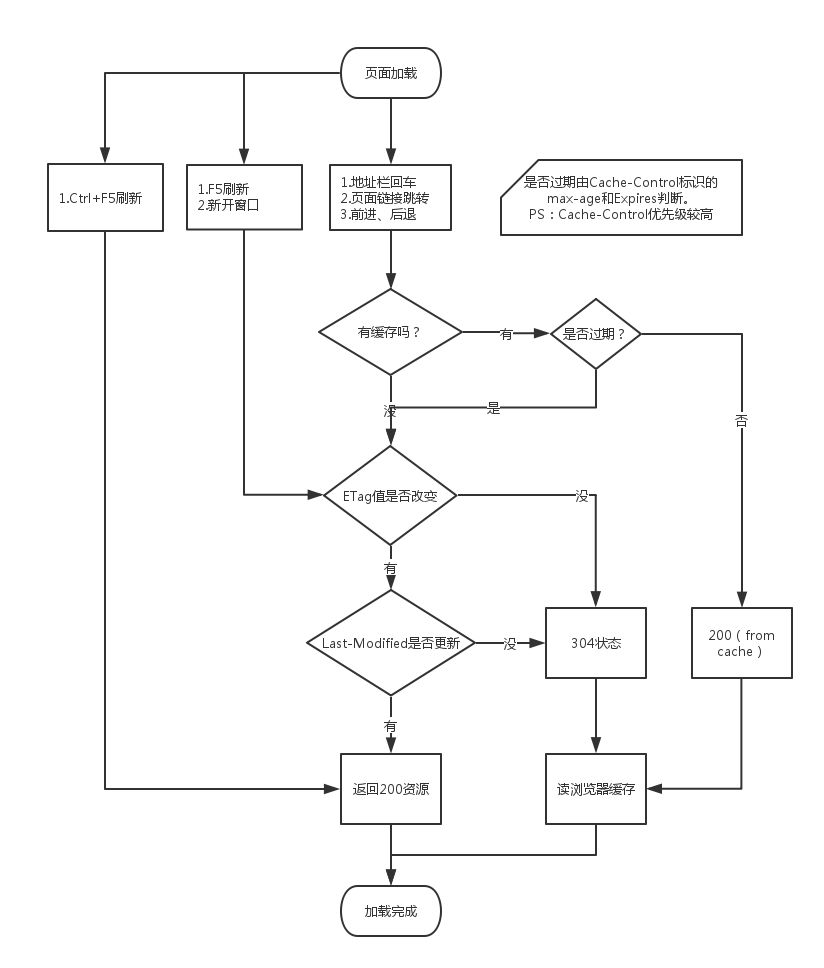
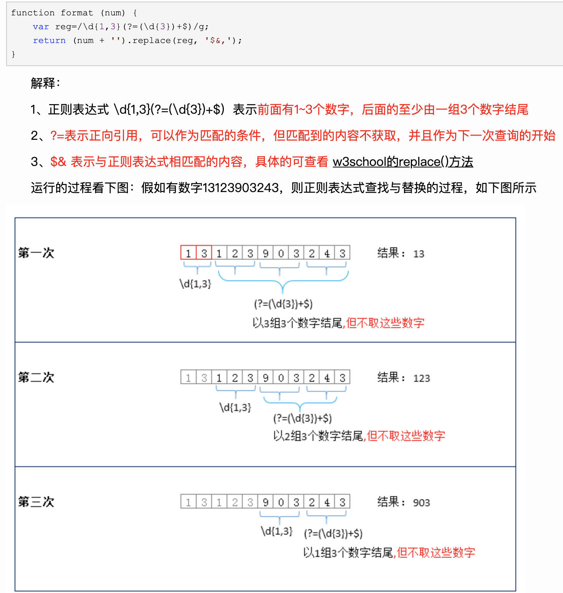

# 日期

## 4/13

### 豪猪

* 预编译：
[为什么要使用CSS预编译处理器](https://blog.csdn.net/qq_40938301/article/details/83651003)

 1. 少使用很多选择器，写起来方便(嵌套式)
 2. mixin/继承(要写很多class ,可以extend混入到一个里面)；(模块化,样式复用)
 3. **可使用变量(减少定制的样式的修改量)**
 4. 兼容性 (postcss-loader)
    缺点: 调试跟难调了; 造成后代选择器的滥用

* node require： 去查询node_modules 然后找到main字段的文件
[node——模块分类，require执行顺序，require注意事项，原理](https://www.cnblogs.com/ellen-mylife/p/10972277.html)

1. node所有内置模块(fs, http...) 在安装时候已经编译成二进制文件,直接加载运行(速度较快)
2. 部分内置,在node.exe进程启动时默认加载,可以直接使用
3. 文件模块, 无后缀, 按照顺序解析, js json node 自定义模块 (所以最好写上后缀)
 加载顺序: 核心模块直接加载, 其他会去当前js目录node_modules.当前没有去上级
 注意事项: 模块第一次加载后会缓存, 第二次直接读取缓存

 加载原理: 第一次加载会运行一次该模块(重复加载只会运行一次)
 **代码原理**: 运行`require`(因为require是定义在Module.prototype里,所以加载都会运行上面的过程)
    1. 查找Module.cache 有无缓存的模块实例,有就直接加载;无插件Module实例,并加入cache中
    2. 调用`module.load()`读取模块内容,然后调用`module.compile()`执行编译
    3. (如果加载失败就从cache中删除这个模块)
    4. 返回 module.export

* 代码评审: 代码风格是否符合规范(命名);代码重复(封装方法调用); **代码设计**? (封装一个时间选择器, 08:30-09:00, for 循环,计算规格转换)
[代码审核](https://blog.csdn.net/qiwoo_weekly/article/details/103021305)
* css选择器: important, 内联, id, (class,属性,伪类focus), (元素标签,伪元素first-letter after)
[css选择器优先级顺序](https://www.cnblogs.com/y1114078559/p/12663926.html)

* flex: 1 表示 1 1 auto
grow: 空间有多余占据; shrink: 空间不够就缩小； **basis**: **给上面两个属性分配多余空间之前**,计算项目是否有多余空间，默认项目本身大小

* 函数式编程

[函数式编程，真香](https://juejin.cn/post/6844903743117361165)
把运算过程尽量写成一系列嵌套的函数调用
1. 增加了函数的可复用性
2. 同时增加了代码的可读性
3. **将纯函数和非纯函数区分开来 (纯函数不受其他影响 没有副作用)**
纯函数: 
    * 仅取决于提供的输入，而不依赖于任何在函数求值或调用间隔时可能变化的隐藏状态和外部状态。 
    * 不会造成超出作用域的变化，例如修改全局变量或引用传递的参数

命令式编程和函数式编程

```js
// 命令式代码

function showStudent(id) {
    // 这里假如是同步查询
    var student = db.get(id)
    if(student !== null) {
          // 读取外部的 elementId
          document.querySelector(`${elementId}`).innerHTML = `${student.id},${student.name},${student.lastname}`
    } else {
        throw new Error('not found')
    }
}

showStudent('666')

// 函数式代码

// 通过 find 函数找到学生
var find = curry(function(db, id) {
    var obj = db.get(id)
    if(obj === null) {
        throw new Error('not fount')
    }
    
    return obj
})

// 将学生对象 format
var csv = (student) => `${student.id},${student.name},${student.lastname}`

// 在屏幕上显示
var append = curry(function(elementId, info) {
    document.querySelector(elementId).innerHTML = info
})
// 拆分为3个函数来实现
var showStudent = compose(append('#student-info'), csv, find(db))

showStudent('666')
```

* 柯里化
把接收多个参数的函数变换成接收一个单一参数并返回接收余下参数并返回结果的函数
[JavaScript函数式编程，真香之组合函数(二)](https://juejin.cn/post/6844903780329357320)
为什么需要使用: 使我们更好的去追求 pointfree，让我们代码写得更优美(不使用所要处理的值，只合成运算过程)

> pointfree: point 表示的就是形参，意思大概就是没有形参的编程风格。 pointfree 的函数的目的是得到另一个函数。

```js
// 这就是有参的，因为 word 这个形参
var snakeCase = word => word.toLowerCase().replace(/\s+/ig, '_');

// 这是 pointfree，没有任何形参
var snakeCase = compose(replace(/\s+/ig, '_'), toLowerCase);

// 函数要找str是否有targetStr (所以先处理要targetStr)
function find(str, targetStr) {
    return str.includes(targetStr)
}
// 这里这样写还是有问题(因为处理函数直接写在里面了, 但先理解概念)
function findCurry(targetStr) {
    return str => str.includes(targetStr);
}
let findXX = findCurry('xx');
const result = compose(findXX, stringReverse, stringToUpper);

let findXX2 = curry(find, 'xx'); // 这样才对
// n元的currying
function currying(fn, ...args) {
    if (args.length >= fn.length) {
        return fn(...args)
    }
    return function (...args2) {
        return currying(fn, ...args, ...args2)
    }
}
```

**扩展阅读**: [JavaScript专题之函数柯里化](https://segmentfault.com/a/1190000010608477)

```js
let person = [{name: 'jack'}]
var name = person.map(function (item) {
    return item.name;
})
// 传入可以复用的函数方法
var prop = curry(function (key, obj) {
    return obj[key]
});

var name = person.map(prop('name'))

// 个人改编 ()
function findName (key, obj) {
    return obj(key);
}
var prop1 = curry(findName, 'name');
let name1 = person.map(prop1);
```

* MongoDB查询 
* 非关系型数据库: 
[常见的关系型数据库和非关系型数据及其区别](https://www.cnblogs.com/aaronthon/p/9459353.html)
严格意义上不是一种数据库,应该是数据结构化存储方式的集合
(结构不固定: 格式灵活; 高扩展性; 速度快: 减少时间和空间的开销，不适合持久存储海量数据)
    关系型: 数据结构是表
     1. 易于维护: 表结构一致 (固定的表结构灵活度欠缺)
     2. 使用方便: 居于sql语句
     3. 复杂操作: 用sql语句对一个或多个表进行复杂的查询
线程进程 资源分配最小单位， 线程 cpu调度最小单位 （火车车厢[线程和进程的区别是什么？](https://www.zhihu.com/question/25532384))

设计模式

洋葱模型(还没看)
[浅析koa的洋葱模型实现](https://segmentfault.com/a/1190000013981513?utm_source=tag-newest)

```js
app.use(async (ctx, next) => {
    console.log(2)
    await next();
    console.log(2)
})
```

什么时候不用key: 数据内容顺序比较稳定且没有后续数据变化
技术深度
新技术 vite 微服务

[MVC，MVP 和 MVVM 的图示](http://www.ruanyifeng.com/blog/2015/02/mvcmvp_mvvm.html)
MVC view （传达指令）=> controller (完成业务逻辑，改变model状态)=> model （新数据发送到view，用户反馈）=>view
视图（View）：用户界面。
控制器（Controller）：业务逻辑
模型（Model）：数据保存
MVP
各部分之间的通信，都是双向的。
View 与 Model 不发生联系，都通过 Presenter 传递。
mvvm Model-View-ViewModel
MVVM: 通过ViewModel 作为连接 view 和model的桥梁
模式将 Presenter 改名为 ViewModel，基本上与 MVP 模式完全一致
唯一的区别是，它采用双向绑定（data-binding）：View的变动，自动反映在 ViewModel

render

### 咏柳科技

* koa中间件 去了解koa技术点
* 代码自动打包（上线
* 技术性的东西(有个模块组合，用了其他插件都达不到效果，去找相关的竞品 没有关于vue框架的，然后就要去用jqurey版本的来进行源代码的修改)

1. 将复杂的支架图纸,各个模块封装成方法,调用绘制
2. 对一些老旧的项目优化webpack打包

#### 虚拟dom如何查找不一样

[前端面试必备技巧（二）重难点梳理](https://juejin.cn/post/6844904152850497544)
虚拟 DOM 的实现原理主要包括以下 3 部分：

用 JavaScript 对象模拟真实 DOM 树，对真实 DOM 进行抽象；
diff 算法 — 比较两棵虚拟 DOM 树的差异；
pach 算法 — 将两个虚拟 DOM 对象的差异应用到真正的 DOM 树。
[深入剖析：Vue核心之虚拟DOM](https://juejin.cn/post/6844903895467032589)
为什么引入虚拟dom： 因为每一次对dom进行操作都会导致马上执行（有些layout可能就好几次无用的）
[Vue 3.0 diff 算法及原理](https://zhuanlan.zhihu.com/p/187544076)
[Vue3diff算法原理和优化](https://blog.csdn.net/frontend_frank/article/details/114297890)

步骤:

1. 预处理，找到新旧树真正需要进行diff的部分（新旧树头尾分别比较，去除相同的节点，同时处理只有新增和只有删除的情况）`i < e1 && i > e2`(移除) `i > e1 && i < e2`(新增)
2. 利用最长递增子序列，完成上述差异比较，提高diff效率； （新树存到map里，遍历旧树查找新树中是否有对应的节点并且所在位置， 用最长递增子序列调整位置）

diff 2.0和3.0的不同

前者是**全量的对比**
后者在模板编译时（生成VNode时候打上标记，在这个基础上进行diff算法）： 大于0表示可被优化或更新；小于0表示需要全量对比
**vue3.0对于不参与更新的元素，做静态标记并提示只会被创建一次，在渲染时直接复用**

数据代理 object 和array
vue3 跟vue2的区别

如何监听
对数组的方法进行劫持，运行劫持的方法去通知dep（数据变化

双向数据绑定:

1. 在Observe阶段 劫持data里面的数据,实现set和get方法,并创建Dep对象
2. 在编译模板阶段创建Watch 并将更新视图的方法作为回调函数传入
3. 在获取数据的时候会触发get方法 将watch跟dep进行绑定
4. 在更改数据的时候会触发set方法,通知dep上所有的watch,watch就会去调用更新视图的方法达到更新界面

新技术：deno, vue3.0, vite
自己想做什么：专门的团队精进一下后端的技能和知识， 摆弄服务端，跟前端一起用最前沿的东西来攻克难关 ； 后续可能还是想往技术上靠
nextTick
[vue首屏加载优化](https://juejin.cn/post/6844904122747977736)

1. 按需加载
2. 异步路由 (webpack使用了jsonp的方式加载)
3. nginx开启gzip
4. 部分模块使用cdn引入(webpack配置externals)

[Webpack性能优化](https://juejin.cn/post/6844904088233050126)

1. 加快打包速度
    * 使用happyPack(利用电脑多核功能, 将任务分解成多个子线程,打完包之后把任务返给主线程) 
    [webpack优化之HappyPack 实战](https://www.jianshu.com/p/b9bf995f3712)
     指定处理的happyPack的id, 在plugin中增加实例跟id对应,配置相关的option (需要该loader支持happyPack css-loader ,url-loader 以及babel0-loader)
    * 部分包noParse表示不用解析
    * 使用include约束包的查找范围
    * dllPlugin 提取固定的第三方包的内容

2. 减少打包体积
    * tree shaking(剔除js死代码, 前提代码是es6模块化语法)
    * 使用external 将包不打入,减少包的大小
    * ignorePlugin(引入包的时候正则排除一些内容不打包进去
    * 提取公共的css文件(splitChunk cacheGroups common)

微信小程序性能优化

1. 分包
2. 不要频繁表用setData方法

## 4/14

### 惠众信用评级

跨域和同源
跨域：两个不同源的网站之间可以相互请求数据的。这就需要使用到跨域
跨域资源共享(CORS)： 服务器允许跨域的代码
跨域行为是浏览器行为，响应是回来了的, 只是浏览器安全机制做了限制, 对于跨域响应内容进行了忽略

xss攻击：代码注入攻击，在目标网站注入恶意脚本，用户输入的数据被当成脚本进行运行
防御： 对于用户输入的 引号，尖括号，斜杆进行转义
富文本用白名单来过滤 标签或者标签属性 过滤一些标签

* CSRF攻击(cross site request forgery)：跨站请求伪造，诱导用户去请求有cookie信息内容的网站
防御： referer(记录http请求的来源地址)过滤; 防止第三方访问用户cookie(http-only); 请求附带token信息去请求已经登录过的网站进行请求（session里面

[http请求头中Referer的含义和作用](https://blog.csdn.net/shenqueying/article/details/79426884)

[COOKIE和SESSION有什么区别？](https://www.zhihu.com/question/19786827/answer/21643186)

1. session 在服务器端，cookie 在客户端（浏览器）
2. session 默认被存在在服务器的一个文件里（不是内存）
3. session 的运行依赖 session id，而 session id 是存在 cookie 中的，也就是说，如果浏览器禁用了 cookie ，同时 session 也会失效（但是可以通过其它方式实现，比如在 url 中传递 session_id）
4. session 可以放在 文件、数据库、或内存中都可以。
5. 用户验证这种场合一般会用 session

ajax原理
[Ajax原理一篇就够了](https://segmentfault.com/a/1190000017396192)

1. 创建XMLHttpRequest，调用open方法，并指定请求路径（指定请求类型）
2. 发送请求 send
3. 监听readyState的回调（4表示完成， 0表示初始化，1表示启动open， 2表示 send， 3表示接受部分
4. 200 成功， 300重定向，400请求错误， 500服务器问题

部分重要状态： 200 ，301 永久重定向，302暂时 304服务端资源未改变从本地读取 400 请求中有错误语法 401认证失败，403 拒绝访问资源 404

[图解Http缓存控制之max-age=0、no-cache、no-store区别](https://zhuanlan.zhihu.com/p/55623075)

强缓存: cache control 状态码 (200);

1. max-age=0 表示xx秒去服务端请求数据 无论是请求头还是响应头(0表示在重新获取资源之前，先检验ETag/Last-Modified) 304
2. no-cache (表示使用缓存时候需要认证)不管服务器有没有过期都去向服务器请求 304 (服务器设置no-cache和max-age=0 表示本地可以存,但是不直接读,需要请求协商后让协商告诉怎么读取)
3. no-cache (请求头中设置的)表示要重新获取请求
3. no-store 才是真正意义上的不进行缓存 (即不能存,下次还是200)

协商缓存是 (如果没有过期是304 ,过期返回200)

* 强缓存和协商缓存
[浏览器缓存](https://www.cnblogs.com/chengxs/p/10396066.html) 详细(细看)

打开 关闭 重新打开 (都是`from disk` ) 之后刷新 部分 `memory cache` 部分 `disk cache`
图片和js文件再次加载 是前者 ,css是后者



原型链
每个函数都有原型属性prototype，最终都指向object，然后每个实例对象都有__proto__属性，指向他的原型，一直通过这个链接起来的关系链叫原型链
[轻松理解JS 原型原型链](https://juejin.cn/post/6844903989088092174)

跨域 option (复杂的请求会触发预检请求)
[【HTTP】如何避免OPTIONS请求？](https://blog.csdn.net/xiaoxiong_jiaxin/article/details/88060663?utm_medium=distribute.pc_relevant.none-task-blog-2%7Edefault%7EBlogCommendFromMachineLearnPai2%7Edefault-2.control&depth_1-utm_source=distribute.pc_relevant.none-task-blog-2%7Edefault%7EBlogCommendFromMachineLearnPai2%7Edefault-2.control)
是浏览器自动发起的，获知服务器是否允许该实际请求, (来决定真正的请求是否足够安全)
简单的请求: 
    1. 请求方式是 GET,POST,HEAD
    2.  

RESTful API 规范

[RESTful API 设计指南](https://www.ruanyifeng.com/blog/2014/05/restful_api.html)
get 获取信息
post 新建信息
put 修改信息
delete 删除信息

分段传输(大文件上传)
`Blob.prototype.slice`
文件FIle对象是Blob对象的子类，Blob对象包含一个重要的方法slice，通过这个方法，我们就可以对二进制文件进行拆分。

### 潘帕斯

组件开发
nextTick
中间件 (还没看)
[逐行分析Koa中间件机制](https://juejin.cn/post/6844903790185807885)
本文分析了其他中间件的原理（还没看）
[Koa2 中间件原理解析 —— 看了就会写](https://segmentfault.com/a/1190000016707059) (告诉每个中间件是如何实现)
[深入理解 Koa2 中间件机制](https://segmentfault.com/a/1190000012881491) (直接从源码里面分析,必须看)
[50行代码学会koa2中间件原理](https://www.imooc.com/article/details/id/280772)

原理: 调用app.use 会将传入的函数push到中间件的数组, 在运行起服务的时候会调用callback, 在里面执行compose函数, 去执行第一个中间件, 遇到`await next`会将后面的代码设置成pending状态去运行下一个中间件,依次往后最后会返回 `Promise.resolve()`,之后返回执行前一个next后面的代码就,直到又回到第一个, 这样实现了洋葱模型

```js
// 组合中间件
function compose(middlewareList) {
    return function (ctx) {
        function dispatch(i) {
            const fn = middlewareList[i]
            try {
                return Promise.resolve(
                    fn(ctx, dispatch.bind(null, i + 1))
                )
            } catch (err) {
                return Promise.reject(err)
            }
        }
        return dispatch(0)
    }
}
```

二维有序变一维有序: 遍历 `xx.concat()` ; `xx.join(',').split(',')`
aaabbbcc记录数量

## 4/15

### 天目传媒

setTimeout setInterval 在事件队列中不同点
大文件上传 (`blob.slice()`)

### 指令集

* SHA256 sha加密

* nextTick 原理

[Vue nextTick 机制](https://juejin.cn/post/6844903599655370765)
实现了异步更新机制: 开启一个异步队列,将所有的数据变更放到队列里面, 在下一次Tick的阶段会运行队列里面的所有watcher的run方法更新视图(每个watcher不会重复被 添加)
运行完之后再执行传入的callback函数
定义的先后顺序: setImmediate --> MessageChannel --> Promise --> setTimeout


```js
var vm = new Vue({
    el: '#example',
    data: {
        msg: 'begin',
    },
    mounted () {
      this.msg = 'end'
      console.log('1')
      setTimeout(() => { // macroTask
         console.log('3')
      }, 0)
      Promise.resolve().then(function () { //microTask
        console.log('promise!')
      })
      this.$nextTick(function () {
        console.log('2')
      })
  }
  // (即每次更新界面数值(造成界面变化),会执行nextTick, 但是在支持MessageChannel和setImmediate的情况下, 会先打印`promise`;
  // 如果不支持,那么 '2' 会被先塞入,后面在运行`promise`)
})

```
视图更新 改变背景 只更新一次
调试： 1.抓包 2.快照（判断是否有内存泄漏 3.硬调

* $set原理

[vue.$set()原理](https://segmentfault.com/a/1190000020659895)

先判断对象是否为数组(splice),再判断改属性是否已存在,都不是就重新调用一次`defineReactive`, 同时触发一次视图的更新 (`dep.notify()`)

* watch原理

[Vue中实现watch侦听器(Vue原理之步骤三)](https://blog.csdn.net/weixin_44976833/article/details/104545634?spm=1001.2014.3001.5501)
创建 Watcher, 将watch方法传入, 会运行 Watcher中的 get() 方法去设置Dep.target为当前Watcher, 运行watcher里面的方法(即触发通知其他值的get方法)
即: **创建一个新的Watcher,并将watch中定义在该属性上的方法作为回调函数, 并将新创建的Watcher实例绑定到Dep上. 那么下次数据变化的时候会去触发set函数去更新界面变化以及触发新Watcher的回调函数通知其他数据变化**

* computed原理

1. 劫持computed定义的数据,并实现get方法
2. 同时创建该计算属性Watcher并标注自己是计算属性,同时创建自己的dep用于收集后续依赖
3. 获取计算属性会调用get方法去获取其他关联值, 触发关联值的get方法,并让该Watcher作为其他关联值的dep的订阅者
4. 后续相关值变动会触发将该Watcher, 重新计算值

`typeof function class`  都是 function
class 和继承 和原型链
工程化 打印package.json
babel 配置
[理解webpack4.splitChunks](https://www.cnblogs.com/kwzm/p/10314438.html)

[Babel 配置用法解析](https://www.cnblogs.com/bai1218/p/12392180.html)
babel插件和babel预设是babel配置的两个主要模块，所以我就放在一起说了。

```js
/* babel.config.js */

module.exports = {
  presets: [
    "@babel/preset-env" // 比下面来的强大（预设包）有各种处理
  ],
  plugins: [
    "@babel/plugin-transform-arrow-functions" // 处理箭头函数
  ]
},

// 配置运行环境
module.exports = {
    presets: [
        [
        "@babel/preset-env", {
            // 什么环境需要转化
            'targets': {
                'browsers': ['ie >= 8', 'iOS 7'] // 支持ie8，直接使用iOS浏览器版本7
            }
        }
        ]
    ],
}
```

单一添加是使用plugins进行一项一项的添加, presets是添加预设包来进行处理(里面集成了很多项插件处理) 

但是上面还要有些最新的接口无法转换,需要使用 `@babel/polyfill`引入所有新的api接口

然后我们只需要在入口文件顶部引入 `@babel/polyfill` 就可以使用新增的API了

但是不会所有的新api都要使用，在 presets里面写按需引入**useBuiltIns**属性来按目标环境引入polyfill

```js
/* babel.config.js */

module.exports = {
  presets: [
    [
      "@babel/preset-env", {
        // 不转换import 避免影响使用treeshaking 
        "modules": false,
        // 将目标浏览器环境所有不支持的API都引入
        "useBuiltIns": "entry",
        'targets': {
          'browsers': ['ie >= 8', 'iOS 7'] // 支持ie8，直接使用iOS浏览器版本7
        }
      }
    ]
  ],
  plugins: []
}
```

### 微易科技保险师

服务器出问题 (心跳，pm2)
前端代码自动化部署

* computed原理
[computed原理](https://blog.csdn.net/qq_21859119/article/details/83001851)
  
  1. 获取computed定义的方法作为自己的getter方法
  2. 创建watcher 和dep

> watcher实例化 dep并向dep.subs添加订阅者， dep通过notify遍历dep.subs通知watcher

tree shaking原理
[tree shaking 及其工作原理](https://segmentfault.com/a/1190000038962700)

条件 (模块必须为esModule, webpack为生成环境, package.json 标识sideEffect为false表示纯正es6模块)

原理:
* es module 引入静态分析，编译时引用（判断加载了哪些模块）
* 静态分析程序流，判断哪些模块和变量未被使用或引用，进而删除对应代码

commonjs 和 es6引入的区别

1、CommonJS 模块输出的是一个值的拷贝，ES6 模块输出的是值的引用。
2、CommonJS 模块是运行时加载，ES6 模块是编译时输出接口。
3、CommonJs 是单个值导出，ES6 Module可以导出多个
4、CommonJs 是动态语法可以写在判断里，ES6 Module 静态语法只能写在顶层
5、CommonJs 的 this 是当前模块，ES6 Module的 this 是 undefined

### 乌鸫

介绍项目： 偏向于可视化的设备选型，在web界面输入自己场景信息内容并配置最终导出可行性的图纸方案和物料清单，服务于售前和技服

RequireJS 和seajs
[SeaJS与RequireJS最大的区别](https://www.douban.com/note/283566440/)
前者是模块预执行 后者是懒执行
SeaJS只会在真正需要使用(依赖)模块时才执行该模块，所以更合适
axios

## 4/16

### 豪猪二面 10:30

* jsonp 跨域
协议、域名、端口三者中任意一个不同
响应数据被浏览器给拦截了，
access control allow origin

* csrf

* event bus
    [VUE中 eventbus 的原理](https://blog.csdn.net/qq_45149256/article/details/112129291?utm_medium=distribute.pc_relevant.none-task-blog-baidujs_title-0&spm=1001.2101.3001.4242)

    即这个vue中有个对象，`$on`就是将事件绑定到callback对象上，`$emit`的时候就去找这个对象查询是否有这个方法，有的话就执行该方法

* 代理原理 vue代理
    启动一个同源的服务进行接口代理 (实际使用node运行一个服务器，将请求发送给自己启动的服务器，再由服务器转发给后台服务器)

* v8垃圾回收原理(谷歌浏览器特有的垃圾回收装置)
    [V8引擎垃圾回收机制分析](https://blog.csdn.net/weixin_41376400/article/details/106076661)
    上面更加详细
    [V8及其垃圾回收机制](https://blog.csdn.net/weixin_45449964/article/details/113819978)
    v8分为新生代对象和老生代对象
    前者存活时间较短; 后者存活时间较长的对象

    回收策略

  * 前者 内存空间一分为二,为to和from区域,先生代会**先存储在from区域**,先处理from区域(用标记清除法),清除完成后,from空间存活复制到to空间然后释放from区域内容,并将to和from空间进行交换
    晋升: 一轮GC处理后存活的新生代对象会转边成老生代对象,来防止新生代对象内存空间占满的情况(多次交换 空间还是存在 5次)
  * 后者 主要还是**标记清除**法, 当晋升导致空间不足时会使用**标记整理**(排序分成1和小于1的腾出空间)碎片化空间; 标记的方式是使用**增量标记**方式对对象进行标记: (因为在标记过程中js不会执行代码,同时考虑对象过多情况标记太多导致卡顿)增量标记在标记过程不是连贯的, 将标记的过程拆分为多个小的过程(优化上面的情况)

### 兴业数字金融服务 14:00

下拉框 select标签
object.length 为undefined
padding不能有负值

### 富通天下 19：30

没问技术

## 4/17

### 指令集二面

业务讨论

## 4/19 周一

### 超视距 14:00

vue源码
koa和express （继续中间件）
* mpvue的坑
    1. 不支持过滤器
    2. 不支持复杂的js渲染表达式(写成computed)
    3. 不支持在template使用methods

* css3 动画

### 恒生电子 19:00

jspdf 将文字和二进制图片进行base64转码,最终转化成pdf文件格式导出(fs.writeFile)
web界面截图（截图api
节流 60Hz，1000/60 所以约等于16ms

[浅析js实现网页截图的两种方式](https://www.jb51.cc/js/526323.html)

* html-to-canvas 
    1. 取出目标模板的所有DOM节点,填充到renderList(附加是否顶层/包含内容的容器等信息)
    2. 通过z-index position float 等css属性和元素将renderList排序,计算出canvas的renderQueue
    3. 遍历renderQueue将css样式转为setFillStyle,根据nodeType调用相应的canvas方法 (fillText, drawImage, fillRect等)

* dom-to-image: svg的foreignObject标签可以包裹任意html内容
    1. 首先，我们要声明一个基础的svg模版，这个模版需要一些基础的描述信息，`foreignObject`标签
    2. 将要渲染的DOM模版模版嵌入foreignObject
    3. 利用Blob构建svg图像
    4. 取出URL，赋值给
    
```js
    //创建模版字符串
    var svgXML=
      `<svg xmlns="http://www.w3.org/2000/svg" width="200" height="200">
        <foreignObject width="100%" height="100%">${generateXML(html)}</foreignObject>
       </svg>`
    //利用Blob创建svg
    var svg = new Blob([svgXML],{type: 'image/svg+xml'})
    //利用DOMURL.createObjectURL取出对象
    var url = window.URL.createObjectURL(svg);
    var img = new Image()
    img.src = url
    return img
```

vue-router 源码(还没看)
[vue-router的使用及实现原理](https://blog.csdn.net/caoxinhui521/article/details/77688512/?utm_medium=distribute.pc_relevant.none-task-blog-baidujs_title-0&spm=1001.2101.3001.4242)

[](https://blog.csdn.net/weixin_33989780/article/details/88771261?utm_medium=distribute.pc_relevant.none-task-blog-2%7Edefault%7EBlogCommendFromMachineLearnPai2%7Edefault-1.control&depth_1-utm_source=distribute.pc_relevant.none-task-blog-2%7Edefault%7EBlogCommendFromMachineLearnPai2%7Edefault-1.control)
* 路由history和hash
    前者：pushState() 和 replaceState() 将url替换并且不刷新页面(不向后端发送请求)
    后者：onhashchange
    优势：
     1. 设置的新url可以与当前url同源的任意url；后者当前url同文档url(因为只能改变# 后面的内容)
     2. 设置的新url可以跟当前一模一样，后者不一样才会触发change
     3. stateObject 参数可以添加任意类型的数据到记录中；而 hash 只可添加短字符串
     4. 可以设置title属性供后续使用
    劣势：部分链接后端没有配合会返回404

订阅发布模式

mutation action 是否通过mutation
事件队列（近一年 一个月

```js
let index = 0;
function test (res, delay) {
    let _index = index + 1;
    index++ ;
    return new Promise((resolve, reject) => {
        setTimeout(() => {
            if (_index === index) {
                resolve(res);
            } else {
                // reject(new Error('数据有问题'));
                resolve('err')
            }
        }, delay)
    })
}


let handle = (res) => {
    if (res === 'err') {
        console.log('不处理')
    } else {
        console.log(res);
    }
}
test(1, 1000).then(handle);
test(2, 50).then(handle);
```

前端的时候有做过什么优化策略

1. 减少http请求：雪碧图；小图用base64
2. css放头部
3. 开启gzip
4. 大的第三方包用cdn
5. webpack优化

## 4/20 周二

### 爱库存 10:00

promise 和async (eɪˈsɪŋk)
[async 函数的含义和用法](http://www.ruanyifeng.com/blog/2015/05/async.html)

* 网络协议
[前端必须了解的网络协议](https://blog.csdn.net/weixin_45073034/article/details/107838951)

七层：

1. 物理层；
2. 数据链路层；
3. 网络层：IP；
4. 传输层（TCP，UDP）；
5. 会话层：DNS；
6. 表示层；
7. 应用层： http(如何包装数据) ftp

* IP 网关 物理地址
查询目标ip的子网掩码跟自己是否匹配，匹配表示在一个网段，直接用mac地址寻找；
如果不是同一个网段，封装上对方的IP地址去找目标地址，发现网关，由网关发送其他网络；
到达目标网络后，根据对方mac寻找目标主机；

[为什么不直接使用ip来发送信息?还要配合mac地址。](https://www.zhihu.com/question/359187717)
IP并不能确定一台机子，mac地址是固定的

### 指令集 hr面 14:00

优点：(开发思绪)灵活? 守时? 
缺点：
业务介绍：闸机难点(业务内容命名规范,导出内容添加水印)

### 朗新科技 15:00

复试沟通 18576071272
网页性能
`service work` (拦截和处理网络请求的功能)
`$nextTick`
`$emit`
`$set`

* 状态码
204 返回信息内容为空
302 暂时的重定向  301永久重定向 304 资源有缓存
400请求写的有问题； 401未授权； 403禁止访问 ； 405资源被禁止
500 服务器有问题； 503 负载或者停机无法处理

### 涂鸦智能 20:00

状态码

* 事件机制
点击具体是先到document然后向下捕获到目标节点之后冒泡到document
即3个阶段 有捕获阶段，目标阶段和冒泡阶段
目标的冒泡和捕获先后？ 看代码的先后

* csrf攻击
诱导用户去请求已经登录过的网站进行请求

* 回流重绘
回流是指 布局或者元素的几何外貌发生改变
重绘指 元素的样式的变化而不引起布局变化
冒泡

## 4/21 周三

### 业金数金 10:00

data的array通过v-for双向数据绑定
两个页面进行交换数据

1. window.location.href = 'b.html?id=xx'
2. localstorage 和sessionstorage 来存储内容统一访问


nextTick
bfc: 块级格式上下文（独立的布局环境, 规定内部如何布局，并内部区域跟外部无关)
[10 分钟理解 BFC 原理](https://zhuanlan.zhihu.com/p/25321647)
触发方式

1. body根元素；
2. float: 不为none
3. position： fixed;absolute;
4. overflow 不为visible
5. display： inline-block； flex

[什么是BFC？看这一篇就够了](https://blog.csdn.net/sinat_36422236/article/details/88763187)
布局影响: 

1. 内部的box会在垂直方向一个接着一个排布 
2. 垂直方向的距离由margin决定,同属于同一个bfc margin会重叠
3. 每个盒子的margin box的左边与包含快的border-box的左边相接触(向右的布局同理)
4. bfc的区域不会受浮动元素重叠
5. 盒子里面的子元素不会影响到其他元素计算
6. 计算bfc区域高度,浮动元素也参与

css3: 边框，圆角，渐变，box-sizing；flex都用 除了动画用的少，其他都用了

### 来未来

diff算法
key值
* 组件（受控和非受控）
    1. 非受控,使用者不需要关心控制组件的状态, 完全由内部维护
    2. 受控 有外部自行维护其状态
* 装饰者模型 (koa中间件就是)

[JavaScript装饰者模式的功能和代理模式区别实例详解](https://www.php.cn/js-tutorial-375303.html)
不动原函数的情况下，给函数添加额外的功能
缺点： 必须维护中间变量；可能this被劫持

* 观察者模型， 订阅模式

[JavaScript设计模式：观察者模式与发布-订阅模式](https://www.cnblogs.com/cuijinlin/p/13790338.html)
前者： 观察者和目标直接进行交互 （降低耦合，两者专注于自身功能）； 缺点：所有观察者都能接收到通知，无法过滤筛选
后者： 发布者和订阅者并不认识（完全解耦）， 多了个事件调度中心；缺点： 额外对象创建，消耗时间和内存（通知哪一个

总结：

1. 前者维护 单一时间对多个依赖事件的对象关系； 后者维护多个事件及依赖各个事件之间的关系；
2. 触发方式： 前者观察者直接触发目标，后者通过事件中心去广播
3. 观察者模式依赖比后者强（解耦）

* 手写中间件

返回`async`函数，接收ctx和next两个入参，并在函数内部最后面调用`next()`

react的区别

改变数据的时候需要手动触发，vue是通过watcher监听改变界面
vue的语法跟html类似，减少了上手难度，

koa洋葱模型(有什么好处)

1. 记录这个处理的时间
2. 由于中间件需要依赖其他中间件，所以要有先后

正则匹配字符串
底层架构方向(项目搭建,ui组件或者业务组件开发)

加密算法
[加密算法比较：SHA1，SHA256，MD5](https://blog.csdn.net/chenze666/article/details/79730753?utm_medium=distribute.pc_relevant_t0.none-task-blog-2%7Edefault%7EBlogCommendFromMachineLearnPai2%7Edefault-1.control&dist_request_id=&depth_1-utm_source=distribute.pc_relevant_t0.none-task-blog-2%7Edefault%7EBlogCommendFromMachineLearnPai2%7Edefault-1.control)

computed原理
[https://blog.csdn.net/qq_21859119/article/details/83001851](浅谈 Vue 中 computed 实现原理)

双向绑定
[Vue源码解读之Dep,Observer和Watcher](https://segmentfault.com/a/1190000016208088)

// 汇总!!! 还没看
[由浅入深，66条JavaScript面试知识点](https://juejin.cn/post/6844904200917221389#heading-27)


自定义指令使用
[Vue自定义指令及使用](https://www.cnblogs.com/dhui/p/13268040.html)
[vue自定义指令--clickOutside](https://blog.csdn.net/qq_40710228/article/details/104668577)
[KOA2 手写中间件 （装饰器模式）](https://blog.csdn.net/weixin_34415923/article/details/87963813)

优化：内存泄漏？ 调整

[JavaScript中常用的设计模式](https://segmentfault.com/a/1190000017787537)

## 5/18

### 缦图

* 伪类和伪元素
[CSS中伪类与伪元素](https://www.zhihu.com/tardis/sogou/art/46909886)伪类 相当于特殊的class选择器，简单说用于元素当前的状态修饰 focus 
伪元素 当前的内容修饰 first-letter（给第一个字符添加修饰，类似给第一个字符添加特殊span标签） after 
区别 有没有创建一个文档之外的元素
promise

* name的作用
[vue中name的作用]（https://blog.csdn.net/qq_38999048/article/details/82772158)

1. 代码调试;
2. keep alive
3. 递归组件运用，将name作为组件标签

* 动态路由
* 微服务
* 设计模型
* 不同页面进行通信: iFrame (document.framesxx.postMessage('数据', '域名'), 子窗口今天 message事件 )
组件循环调用
Webpack优化

### 同花顺(19:00)

* mixin 不同页面引入 (是否会改变内容) 看起来是不会的
[Vue项目经验分享：用mixin合并重复代码](https://blog.csdn.net/TB199404/article/details/110089213)

* 技术层面的内容: canvas将各个图形模块封装方法调用组装画图, 前端的excel和pdf的导出,公司sso集成


* slot 插槽有哪几种：
非具名插槽和具名插槽  

```html
<template v-slot:xx /> 传参 
<template v-slot:default="slotProps">
    {{ slotProps.user.firstName }}
</template>
```

slot标签上绑定数据， 父内容的template读取

```html
<span>
  <slot v-bind:user="user">
    {{ user.lastName }}
  </slot>
</span>
想换掉备用内容，用名而非姓来显示

绑定在 <slot> 元素上的 attribute 被称为插槽 prop。现在在父级作用域中，我们可以使用带值的 v-slot 来定义我们提供的插槽 prop 的名字
<current-user>
  <template v-slot:default="slotProps">
    {{ slotProps.user.firstName }}
  </template>
</current-user>

```

* keep-alive两个生命周期
activated 和deactivated （写在vue的生命周期里面， 但是必须要keep-alive标签才能触发）

* vue通信

[vue组件间通信六种方式（完整版）](https://segmentfault.com/a/1190000019208626)

1. `$set` 
2. eventBus `$emit` `$on`
3. `$attrs` `$listeners`
4. `provide` `inject`
5. `$ref.xx`  `$ref.parent`
6. `vuex`

## 5/19

### 缦图 (10:00)

问了技术点

### 大华(14:00)

### 中控(16:00)

tcp三次握手和四挥手
websocket

### 恒生 18:30

## 5/20

### 蘑菇屋(10:00)

diff算法

放弃循环递归的对节点依次比较,从原来的O(N^3) 到现在的 O(N)

优化的举措有(2.0) **分层diff**: 不考虑层级移动节点,无序循环递归,(主要这种方式是 DOM节点跨层级移动操作比较少,可以忽略不计)


proxyTable

第三方js库引入:  1. cdn  2. webpack配置alias  `import $ from 'jquery'`
100 信息,服务器收到请求,需要请求者继续执行操作 (100 continue)

* webpack 热更新 (Hot module replacement) hmr

通过websocket进行连接, webpack内部监听代码变化, 每次热更新都会携带hash值的json文件和js文件
[简单了解webpack热更新原理](https://zhuanlan.zhihu.com/p/222582852)
[轻松理解webpack热更新原理](https://blog.csdn.net/chern1992/article/details/106893227)

js 字符串索引无法赋值(因为这个是属于只读, 不可改变)
[js字符串索引赋值的问题](https://www.h5w3.com/26113.html)

```js
let str = '123'
undefined
str[1]= 3
3
str
'123'
```

### 补缺

盒子模型 (w3c content-box ; ie border-box)
前者预设的宽度 不包括padding和border ;  后者设置会占用设定的宽度 (即内容会因为padding展示变少)

技术选型 技术方案 技术难点
基础

## 滴滴

```js
let a = [1,2,2]
let b = [2,2,3];
function merge () {
    let obj = {};
    let arr = [];
    a.forEach(v => {obj[v] ? (obj[v] += obj[v]) : obj[v] = 1})
    b.forEach(v => {
        if (obj[v] > 0) {
            arr.push(v);
            obj[v]--
        }
    })
    return arr;
}
// console.log(merge(a, b))

let str = 'aab'

let node = {
    val: '',
    next: null
}

function fn (head) {
    if (head.next === null) return false;
    let p = head;
    let q = head;
    while (q != null) {
        q = q.next.next;
        p = p.next;
        // 表示有环
        if (p === q) {
            return true
            // 如何找到这个节点

        }
    }

    return false;
}

```

### 二面

grid布局
[grid布局](http://www.ruanyifeng.com/blog/2019/03/grid-layout-tutorial.html)

* http1,2,3
1.* 一个请求响应,建立连接,结束断开连接;每次请求都要连接一次
1.1 采用 keep-alive: 请求排队串行处理,需等待前面处理完; 
    长链接复用:
        1. 浏览器客户端在同一时间，针对同一域名下的请求有一定数量限制。超过限制数目的请求会被阻塞。
        2. 许多图像的网页文件的多个请求和应答可以在一个连接中传输，但每个单独的网页文件的请求和应答仍然需要使用各自的连接(同时保证请求返回按照发送的时间来)
2.0 采用 多路复用: 并行处理, 一个请求任务的耗时不会影响其他链接

flex-shrink: 0;// 表示空间不够不缩小 (默认值是1, 表示空间不够要缩小)

* js 正则 千分位

[JS实现千分位](https://www.cnblogs.com/goloving/p/9393556.html)


```js
function reverseStr(str){
    return str.split('').reverse().join('');
}
function replace3Int(str){
    return str.replace(/(\d{3})(?=\d)/g, '$1,')
}

function  currency (intStr) {
    return  reverseStr(replace3Int(reverseStr(intStr) ))
}

var a = '12345678';
currency(a);
// "12,345,678"

num.toLocaleString(); // 但要主要小数点会被缩小
```

* gpu加速

硬件加速意味着浏览器会帮你把一部分对渲染页面来说较繁重的任务交给GPU:

为动画DOM元素添加CSS3样式 `transform:transition3d(0,0,0)/translateZ`

合成层
`will-change`
[CSS硬件加速的好与坏](https://efe.baidu.com/blog/hardware-accelerated-css-the-nice-vs-the-naughty/)

[前端性能优化](https://zhuanlan.zhihu.com/p/133225734)

### 组件异步加载

`const search = resolve => require(['./search.vue'], resolve);`

### 前端 技术难点

### 性能优化

Object.freeze()冻结
`this.item = Object.freeze(Object.assign({}, this.item))`

后端分页,然后前端滚动到到底部加载后续内容

图片使用懒加载

如果数据过多采用分片处理, 每个requestAnimationFrame加载显示一页数据

### loader用于将不同的语言转换成可被webpack使用代码

