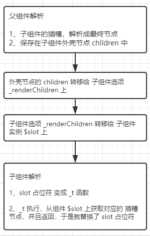

# 面经

## webpack打包原理

1. 加载webpack的配置文件;
2. 创建compiler对象,并加载所有的插件,开始**执行解析项目**
3. 加载entry入口文件,并**导入**依赖的模块,并生成**依赖关系树**
4. **对不同类型的依赖文件**通过loader进行编译,最终生成js文件
5. 根据output的配置将文件写入到具体位置

## 宏任务微任务

**执行栈**执行任务的时候遇到异步任务会将他塞到**事件队列**里面,当执行栈为空的时候会运行事件队列里面的事件
宏任务: setTimeout, setInterval, script
微任务: promise, **Object.observe** 用于监听对象变化,回调函数的入参打印为如何改变 `// [{name: 'baz', object: <obj>, type: 'add'}]`

结合webpack 路由懒加载

## 如何实现slot

[【Vue原理】Slot - 白话版](https://zhuanlan.zhihu.com/p/57427566)
[【Vue原理】Slot - 源码版之普通插槽](https://zhuanlan.zhihu.com/p/57570713)

1、插槽内容怎么解析
2、插槽如何插子页面

```html
<div class=''>
    <test>
        我是组件的slot：{{name}}
    </test>
</div>

<main>
    我是子组件内容
    <slot></slot>
</main>
```

1. 先解析父组件内容，由于不存在test标签，到后面处理
2. 父组件解析成功后，得到vnode，patch (创建DOM并插入页面) ，由于没有test标签，会当成组件解析
    > 注：调用$mounte => template模板 => render函数
3. 解析test组件时，使用_init方法初始化test组件实例，将插槽节点转存到组件的renderChildren，最后放到 $slot中
4. test实例化完毕，使用组件模板去构建他的渲染函数，slot会被解析成 _t('default') ， 而_t是randerSlot 用于返回$slot保存的对应的插槽节点



## 组件通信 watch computed哪个先触发

computed 在HTML DOM加载后马上执行
watch 用于观察Vue实例上的数据变化
默认加载的时候 是先 computed 后watch。 更新数据： computed由于是数据变化导致另外一个变化，所以比较滞后。

`initState()`是在`beforeCreate`和`created`之间，`initState()`包括初始化 `Props，methods`,`data`和`computed`的初始化都是在`beforeCreated`和`created`之间完成的

区别： computed 计算属性只有在相关的数据发生变化时才会改变要计算的属性，当相关数据没有变化时，它会读取缓存。而不必想 methods方法 和 watch 方法是的每次都去执行函数。
computed 用于 一个数据受多个数据影响； watch 用于一个数据影响多个

## loader 和plugin的实现?


## router-link和a标签的区别

* 通过a标签打开是重新加载（相对于重新打开了一个页面
* 通过router-link 不会跳转到新的页面，不会重新渲染，选择路由所指的组件进行渲染，减少了DOM性能的损耗

## 单页面和多页面的优缺点

* 优点： 前端后端分离；切换页面快
* 缺点：不利于爬虫**SEO**； 初次加载时耗较多；

## vuex原理

[Vuex从使用到原理解析](https://zhuanlan.zhihu.com/p/78981485)
调用install方法，将store挂在到vue实例上

1. vuex的store是如何挂载注入到组件中呢？
2. vuex的state和getters是如何映射到各个组件实例中响应式更新状态呢？

1. 调用install方法的时候会使用调用混入函数 （混入里面是Vue生命周期beforeCreate钩子混入vuexInit方法）， 所以vue就会运行这个方法来注册进去
    
2. vuex借助vue data的响应式，将state存到vue的data里面（创建新的vue实例），getters就是借助vue的computed。

## 混入

混入对象可以包含任意组件选项。

1. 合并（数据对象）： 数据对象以本身组件的数据优先
2. 合并（同名钩子函数）：同名钩子函数合并为数组，混入钩子先于自身钩子之前
3. 合并（值为对象选项）：值为对象选项如（methods,components, directives) 将别合并为同一个对形象(同第一条)

vue源码(文件里面)

业务: 工具平台, 集成sso, cloud api, auth2