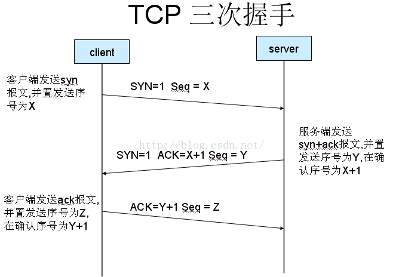

# 两者区别

https是 在http上建立SSL加密层，并对传输数据进行加密，是http协议的安全版

## 渲染url

获取url，解析出ip地址，本地host优先 然后dns解析
tcp三次握手连接
客户端发送http请求
服务器处理请求并响应
浏览器处理资源文件并渲染
tcp4次挥手

## 三次握手

同步序列编号（Synchronize Sequence Numbers）
（B）ACK：确认序号有效。
（C）PSH：接收方应该尽快将这个报文交给应用层。
（D）RST：重置连接。
（E）SYN：发起一个新连接。
（F）FIN：释放一个连接。

1. 客户端采用tcp发送syn数据包给服务器，等待服务器确认
2. 服务器接收确认syn后，同时携带ack标志的syn的数据给客户端
3. 客户端收到syn+ack 会向服务器发送ack标志，同时连接成立

需要注意的是：
（A）不要将确认序号Ack与标志位中的ACK搞混了。
（B）确认方Ack=发起方Req+1，两端配对。

## 四次挥手

1. 当客户端的数据传输到尾部时，**客户端向服务器发送带有FIN标志的数据包**，使其明白自己准备断开通信了。 TCP规定，FIN报文段即使不携带数据，也要消耗一个序号。
2. 因为TCP的通信是使用全双工通信的，所以在断开连接的时候也应该是双向的；当服务器收到带有FIN标志的数据包时，
   其必不会直接发送FIN标志断开通信的请求，而是**先发送一个带有ACK标志的应答信息，使客户端明白服务器还有数据要进行发送。**
3. 服务器的数据发送完成后，向客户端发送带有FIN标志的数据包，通知客户端断开连接。
4. 当客户端收到FIN后，担心某些不可控制的因素导致服务器不知道他要断开连接，会发送ACK进行确认，同时把自己设置成TIME_WAIT状态并启动定时器，在TCP的定时器到达后客户端并没有接收到请求，会重新发送；当服务器收到请求后就断开连接；当客户端等待2MLS（两倍报文最大生存时间）后，没有收到请求重传的请求后，客户端这边就断开连接，整个TCP通信就结束了。

**为什么是4次**
当收到对方的FIN报文时，仅仅表示对方不再发送数据了但是还能接收数据，己方也未必全部数据都发送给对方了，所以己方可以立即close，也可以发送一些数据给对方后，再发送FIN报文给对方来表示同意现在关闭连接，因此，己方ACK和FIN一般都会分开发送。

## https传输过程

[HTTPS加密过程和TLS证书验证](https://juejin.cn/post/6844903545272041479)

1. 在服务器端存在一个公钥及私钥
2. 客户端从服务器取得这个公钥
3. 客户端产生一个随机的密钥
4. 客户端通过公钥对密钥加密（非对称加密）
5. 客户端发送到服务器端(用私钥解密)
6. 服务器端接受这个密钥并且以后的服务器端和客户端的数据全部通过这个密钥加密

## https和http的区别

1.https需要证书。
2.http是超文本传输协议，是明文传输，https则是具有安全性的ssl加密传输协议。
3.http和https使用的端口不同，前者是80，后者是443。
4.http的连接很简单，无状态；HTTPS是由SSL+HTTP构建的可进行加密传输、身份认证的网络协议，比http协议安全。
