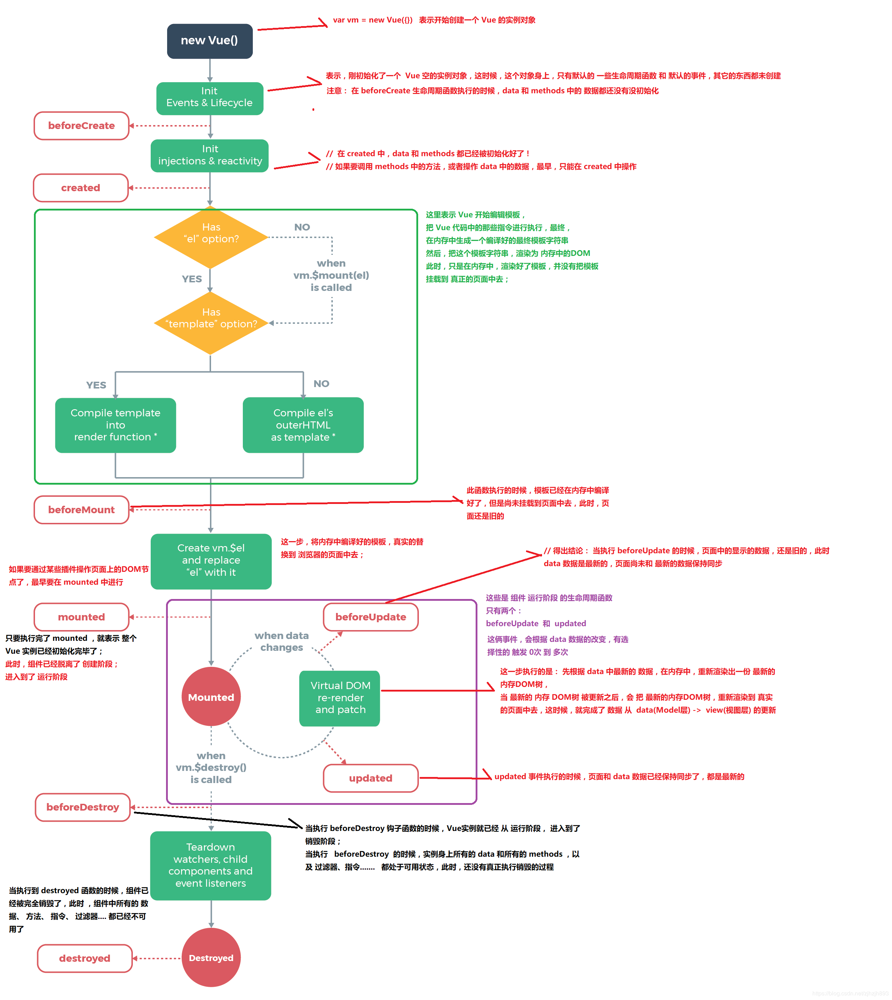
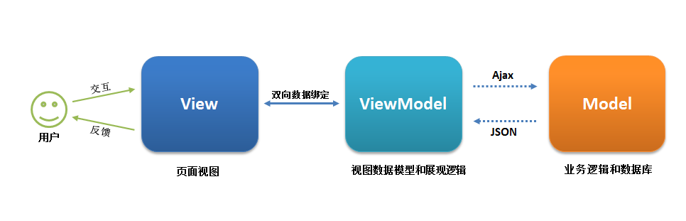
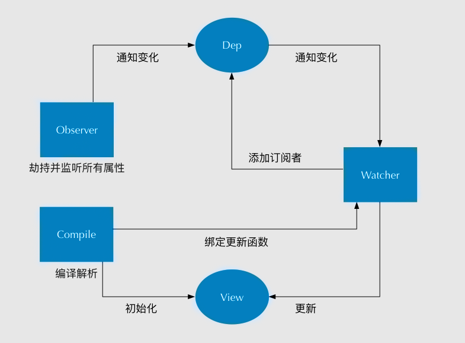

# Vue

<https://juejin.im/post/5d59f2a451882549be53b170?utm_source=gold_browser_extension>

## SPA

仅在web页面初始化加载相应的html,js和css. 一旦页面加载完成,spa不会因为用户的操作而进行页面的重新加载或跳转;取而代之的是利用路由机制实现html页面的变化避免页面重新加载

缺点:

1. 不好爬虫去爬取:SEOSearch Engine Optimization
2. 初次加载耗时过多,所以后面引入页面的按需加载
3. 前进后退的路由管理: 不同页面都在单一页面中跳转

优点:

1. 后续页面跳转快,避免重复的渲染
2. 所以服务器压力相对小点
3. 前后端分离

## v-if 和 v-show

前者切换的时候事件监听和标签都会被销毁和重建;条件不成立的时候就不会渲染;
后者无论条件是否成立都会被渲染,只不过不显示

## vue的单向数据流

父向子传递数据通过prop**单向下行绑定**,子不能通过prop向上传递数据,并且不能改变prop的值; 如需改变定义个计算属性,使用计算属性

## computed 和 watch

前者依赖于其他的值的变化而变化; 后者监听数据自己的变化并做相应的操作

## vue生命周期

beforeCreate created beforeMounte mounted
开始创建、初始化数据、编译模版、挂载 Dom -> 渲染、更新 -> 渲染、卸载等一系列过程，我们称这是 Vue 的生命周期。
beforeCreate
组件实例被创建之初，组件的属性生效之前

created
组件实例已经完全创建，属性也绑定，但真实 dom 还没有生成，$el 还不可用

beforeMount
在挂载开始之前被调用：相关的 render 函数首次被调用

mounted
el 被新创建的 vm.$el 替换，并挂载到实例上去之后调用该钩子

beforeUpdate
组件数据更新之前调用，发生在虚拟 DOM 打补丁之前

update
组件数据更新之后

activited
keep-alive 专属，组件被激活时调用

deadctivated
keep-alive 专属，组件被销毁时调用

beforeDestory
组件销毁前调用

destoryed
组件销毁后调用

## 父子组件生命周期

Vue 的父组件和子组件生命周期钩子函数执行顺序可以归类为以下 4 部分：

加载渲染过程
父 beforeCreate -> 父 created -> 父 beforeMount -> 子 beforeCreate -> 子 created -> 子 beforeMount -> 子 mounted -> 父 mounted

子组件更新过程
父 beforeUpdate -> 子 beforeUpdate -> 子 updated -> 父 updated

父组件更新过程
父 beforeUpdate -> 父 updated

销毁过程
父 beforeDestroy -> 子 beforeDestroy -> 子 destroyed -> 父 destroyed

## 哪个生命周期内调用异步请求

可以在钩子函数 created、beforeMount、mounted 中进行调用，因为在这三个钩子函数中，**data 已经创建**，可以将服务端端返回的数据进行赋值。

推荐在 created 钩子函数中调用异步请求，因为在 created 钩子函数中调用异步请求有以下优点：

能更快获取到服务端数据，减少页面 loading 时间；
ssr 不支持 beforeMount 、mounted 钩子函数，所以放在 created 中有助于一致性；

## keep-alive

用于缓存组件内容,和动态组件一同 使用

提供 include 和 exclude 属性，两者都支持字符串或正则表达式， include 表示只有名称匹配的组件会被缓存，exclude 表示任何名称匹配的组件都不会被缓存 ，其中 exclude 的优先级比 include 高；

两个钩子函数 activated 和 deactivated ，当组件被激活时，触发钩子函数 activated，当组件被移除时，触发钩子函数 deactivated。

## 组件中 data 为什么是一个函数

组件是用来复用的，且 JS 里对象是引用关系，如果组件中 data 是一个对象，那么这样**作用域**没有隔离，子组件中的 data 属性值会相互影响，如果组件中 data 选项是一个函数，那么**每个实例可以维护一份被返回对象的独立的拷贝**，组件实例之间的 data 属性值不会互相影响；

## v-model

text 和 textarea 元素使用 value 属性和 input 事件；
checkbox 和 radio 使用 checked 属性和 change 事件；
select 字段将 value 作为 prop 并将 change 作为事件。

## vue组件见通信方式

父子组件通信、隔代组件通信、兄弟组件通信

（1）props / $emit  适用 父子组件通信
这种方法是 Vue 组件的基础，相信大部分同学耳闻能详，所以此处就不举例展开介绍。
（2）ref 与 $parent / $children 适用 父子组件通信

ref：如果在普通的 DOM 元素上使用，引用指向的就是 DOM 元素；如果用在子组件上，引用就指向组件实例
$parent / $children：访问父 / 子实例

（3）EventBus （$emit / $on）  适用于 父子、隔代、兄弟组件通信
这种方法通过一个空的 Vue 实例作为中央事件总线（事件中心），用它来触发事件和监听事件，从而实现任何组件间的通信，包括父子、隔代、兄弟组件。
（4）$attrs/$listeners 适用于 隔代组件通信

$attrs：包含了父作用域中不被 prop 所识别 (且获取) 的特性绑定 ( class 和 style 除外 )。当一个组件没有声明任何 prop 时，这里会包含所有父作用域的绑定 ( class 和 style 除外 )，并且可以通过 v-bind="$attrs" 传入内部组件。通常配合 inheritAttrs 选项一起使用。
$listeners：包含了父作用域中的 (不含 .native 修饰器的)  v-on 事件监听器。它可以通过 v-on="$listeners" 传入内部组件

（5）provide / inject 适用于 隔代组件通信
祖先组件中通过 provider 来提供变量，然后在子孙组件中通过 inject 来注入变量。 provide / inject API 主要解决了跨级组件间的通信问题，不过它的使用场景，主要是子组件获取上级组件的状态，跨级组件间建立了一种主动提供与依赖注入的关系。
（6）Vuex  适用于 父子、隔代、兄弟组件通信
Vuex 是一个专为 Vue.js 应用程序开发的状态管理模式。每一个 Vuex 应用的核心就是 store（仓库）。“store” 基本上就是一个容器，它包含着你的应用中大部分的状态 ( state )。

Vuex 的状态存储是响应式的。当 Vue 组件从 store 中读取状态的时候，若 store 中的状态发生变化，那么相应的组件也会相应地得到高效更新。
改变 store 中的状态的唯一途径就是显式地提交  (commit) mutation。这样使得我们可以方便地跟踪每一个状态的变化。

**v-model是v-bind:value和v-on:input的简写，所以在父组件你完全可以直接写 `:value="name",@input="val => name = val"`**

## 用过vuex吗

Vuex 是一个专为 Vue.js 应用程序开发的状态管理模式。每一个 Vuex 应用的核心就是 store（仓库）。“store” 基本上就是一个容器，它包含着你的应用中大部分的状态 ( state )。
（1）Vuex 的状态存储是响应式的。当 Vue 组件从 store 中读取状态的时候，若 store 中的状态发生变化，那么相应的组件也会相应地得到高效更新。
（2）改变 store 中的状态的唯一途径就是显式地提交 (commit) mutation。这样使得我们可以方便地跟踪每一个状态的变化。
主要包括以下几个模块：

State：定义了应用状态的数据结构，可以在这里设置默认的初始状态。// 类似data
Getter：允许组件从 Store 中获取数据，mapGetters 辅助函数仅仅是将 store 中的 getter 映射到局部计算属性。// 类似computed
Mutation：是唯一更改 store 中状态的方法，且必须是同步函数。// 类似methods
Action：用于提交 mutation，而不是直接变更状态，可以包含任意异步操作。// 类似异步提交方法
Module：允许将单一的 Store 拆分为多个 store 且同时保存在单一的状态树中。

## SSR

对不起没开发过

>Vue.js 是构建客户端应用程序的框架。默认情况下，可以在浏览器中输出 Vue 组件，进行生成 DOM 和操作 DOM。然而，也可以将同一个组件渲染为服务端的 HTML 字符串，将它们直接发送到浏览器，最后将这些静态标记"激活"为客户端上完全可交互的应用程序。
***
>即：SSR大致的意思就是vue在客户端将标签渲染成的整个 html 片段的工作在服务端完成，服务端形成的html 片段直接返回给客户端这个过程就叫做服务端渲染。

（1）服务端渲染的优点：

更好的 SEO： 因为 SPA 页面的内容是通过 Ajax 获取，而搜索引擎爬取工具并不会等待 Ajax 异步完成后再抓取页面内容，所以在**SPA 中是抓取不到页面通过 Ajax 获取到的内容**；而 SSR 是直接由服务端返回已经渲染好的页面（数据已经包含在页面中），所以搜索引擎爬取工具可以抓取渲染好的页面；
更快的内容到达时间（首屏加载更快）： SPA 会等待所有 Vue 编译后的 js 文件都下载完成后，才开始进行页面的渲染，文件下载等需要一定的时间等，所以首屏渲染需要一定的时间；SSR 直接由服务端渲染好页面直接返回显示，无需等待下载 js 文件及再去渲染等，所以 SSR 有更快的内容到达时间；

（2) 服务端渲染的缺点：

更多的开发条件限制： 例如服务端渲染只支持 beforCreate 和 created 两个钩子函数，这会导致一些外部扩展库需要特殊处理，才能在服务端渲染应用程序中运行；并且与可以部署在任何静态文件服务器上的完全静态单页面应用程序 SPA 不同，服务端渲染应用程序，需要处于 Node.js server 运行环境；
更多的服务器负载：在 Node.js  中渲染完整的应用程序，显然会比仅仅提供静态文件的  server 更加大量占用CPU 资源 (CPU-intensive - CPU 密集)，因此如果你预料在高流量环境 ( high traffic ) 下使用，请准备相应的服务器负载，并明智地采用缓存策略。

## MVVM

MVVM 的核心是 ViewModel 层，它就像是一个中转站（value converter），负责转换 Model 中的数据对象来让数据变得更容易管理和使用，该层向上与视图层进行双向数据绑定，向下与 Model 层通过接口请求进行数据交互，起呈上启下作用。如下图所示：

(1)View 层
View 是视图层，也就是用户界面。前端主要由 HTML 和 CSS 来构建 。
(2)Model 层
Model 是指数据模型，泛指后端进行的各种业务逻辑处理和数据操控，对于前端来说就是后端提供的 api 接口。

这样 View 层展现的不是 Model 层的数据，而是 ViewModel 的数据，由 ViewModel 负责与 Model 层交互，这就完全解耦了 View 层和 Model 层，这个解耦是至关重要的，它是前后端分离方案实施的重要一环。

## 数据的双向绑定

Vue 主要通过以下 4 个步骤来实现数据双向绑定的：
实现一个监听器 Observer：对数据对象进行遍历，包括子属性对象的属性，利用 Object.defineProperty() 对属性都加上 setter 和 getter。这样的话，给这个对象的某个值赋值，就会触发 setter，那么就能监听到了数据变化。
实现一个解析器 Compile：解析 Vue 模板指令，将模板中的变量都替换成数据，然后初始化渲染页面视图，并将每个指令对应的节点绑定更新函数，添加监听数据的订阅者，一旦数据有变动，收到通知，调用更新函数进行数据更新。
实现一个订阅者 Watcher：Watcher 订阅者是 Observer 和 Compile 之间通信的桥梁 ，主要的任务是订阅 Observer 中的属性值变化的消息，当收到属性值变化的消息时，触发解析器 Compile 中对应的更新函数。
实现一个订阅器 Dep：订阅器采用 发布-订阅 设计模式，用来收集订阅者 Watcher，对监听器 Observer 和 订阅者 Watcher 进行统一管理。
<https://juejin.im/post/5d421bcf6fb9a06af23853f

## Proxy 与 Object.defineProperty 优劣对比

Proxy 的优势如下:

Proxy 可以直接监听对象而非属性；
Proxy 可以直接监听数组的变化；
Proxy 有多达 13 种拦截方法,不限于 apply、ownKeys、deleteProperty、has 等等是 Object.defineProperty 不具备的；
Proxy 返回的是一个新对象,我们可以只操作新的对象达到目的,而 Object.defineProperty 只能遍历对象属性直接修改；
Proxy 作为新标准将受到浏览器厂商重点持续的性能优化，也就是传说中的新标准的性能红利；

唯一缺点 兼容性不好

## $set如何实现响应式

* 如果目标是数组，直接使用数组的 splice 方法触发相应式；

* 如果目标是对象，会先判读属性是否存在、对象是否是响应式，最终如果要对属性进行响应式处理，则是通过调用   defineReactive 方法进行响应式处理（ defineReactive 方法就是  Vue 在初始化对象时，给对象属性采用 Object.defineProperty 动态添加 getter 和 setter 的功能所调用的方法）

## 虚拟 DOM 的优缺点

优点：

* **保证性能下限**： 框架的虚拟 DOM 需要适配任何上层 API 可能产生的操作，它的一些 DOM 操作的实现必须是普适的，所以它的性能并不是最优的；但是比起粗暴的 DOM 操作性能要好很多，因此框架的虚拟 DOM 至少可以保证在你不需要手动优化的情况下，依然可以提供还不错的性能，即保证性能的下限；
* **无需手动操作 DOM**： 我们不再需要手动去操作 DOM，只需要写好 View-Model 的代码逻辑，框架会根据虚拟 DOM 和 数据双向绑定，帮我们以可预期的方式更新视图，极大提高我们的开发效率；
* **跨平台**： 虚拟 DOM 本质上是 JavaScript 对象,而 DOM 与平台强相关，相比之下虚拟 DOM 可以进行更方便地跨平台操作，例如服务器渲染、weex 开发等等。

缺点:

无法进行极致优化： 虽然虚拟 DOM + 合理的优化，足以应对绝大部分应用的性能需求，但在一些性能要求极高的应用中虚拟 DOM 无法进行针对性的极致优化。

## 虚拟DOM实现原理

不知道 吼吼

## Vue 项目进行哪些优化

（1）代码层面的优化

v-if 和 v-show 区分使用场景
computed 和 watch  区分使用场景
v-for 遍历必须为 item 添加 key，且避免同时使用 v-if
长列表性能优化
事件的销毁
图片资源懒加载
路由懒加载
第三方插件的按需引入
优化无限列表性能
服务端渲染 SSR or 预渲染

（2）Webpack 层面的优化

Webpack 对图片进行压缩
减少 ES6 转为 ES5 的冗余代码
提取公共代码
模板预编译
提取组件的 CSS
优化 SourceMap
构建结果输出分析
Vue 项目的编译优化

（3）基础的 Web 技术的优化

开启 gzip 压缩

浏览器缓存

CDN 的使用

使用 Chrome Performance 查找性能瓶颈

## vue3.0新特性

1. 在observer里对数据的劫持可能用Proxy来替代Object.defineProperty
2. 对象式的组件声明方式可能要结合TypeScript

## Vue中遇到的坑

就是vue的就地覆用

3个v-if出来的 其中第一个和第三个是地图
每次切到第三个地图总会有点问题,后来给1和3 分别加了个key就好了 ,一开始还以为是地图代码的问题
