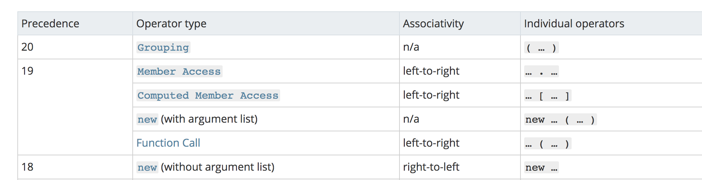

# Interview

// https://yuchengkai.cn/docs/frontend/#%E6%B7%B1%E6%8B%B7%E8%B4%9D

## 内置类型

基本类型和对象类型
六个基本： undefined，null，boolean，number，string，symbol

字面量和变量
var a = 11;
a是xx变量； 11就是xx字面量 （js无类型，普通的话 String a ，那么xx就是字符串变量）
>对于基本类型，使用字面量方式，这个变量只是个字面量（即上面的11并不是number类型），只有在必要的时候才会转换成对应的类型
typeof a // 使用的时候才会转换的对应类型

## typeof

typeof对于基本类型 ，只有null显示会有问题(object) 其他都是对应类型
对于对象，除了函数（function）其他都是object

用 来去区分 Object.prototype.toString.call(xx)
获得类似 [object Type] 的字符串

## 类型转化

转Boolean，除了 undefined， null， false， NaN， ''， 0， -0，其他所有值都转为 true
及时是空对象 也是true

## 对象转化

先 valueOf  然后toString，同时你可以重写这两个方法
let a = {
    valueOf() {
        return 0
    }
}
这样 拿a去做数字运算a就会被转变成0进行运算
>当然你也可以重写 Symbol.toPrimitive ，该方法在转基本类型时调用优先级最高。

``` // 按优先级转化
let a = {
    valueOf() {
        return 0;
  },
  toString() {
    return '1';
  },
  [Symbol.toPrimitive]() {
    return 2;
  }
}
1 + a // => 3
'1' + a // => '12' // 把symbol那行去掉输出的是10 并不是11
```

### 四则运算

对于加法 其中有字符串类型，就全转字符串；其他运算，其中有数字就全转数字
1 + '1' // '11'
2 * '2' // 4
[1, 2] + [2, 1] // '1,22,1'
// [1, 2].toString() -> '1,2'
// [2, 1].toString() -> '2,1'
// '1,2' + '2,1' = '1,22,1'

## new

new 的实现及new的优先级

function Foo() {
    return this;
}
Foo.getName = function () {
    console.log('1');
};
Foo.prototype.getName = function () {
    console.log('2');
};

new Foo.getName();   // -> 1
new Foo().getName(); // -> 2

new Foo() 的优先级大于 new Foo
所以上面的结果是
new (Foo.getName());
(new Foo()).getName();
>对于第一个函数来说，先执行了 Foo.getName() ，所以结果为 1；对于后者来说，先执行 new Foo() 产生了一个实例，然后通过原型链找到了 Foo 上的 getName 函数，所以结果为 2。

## instanceof判断对象的类型

内部机制是通过判断对象的原型链中是不是能找到类型的 prototype

``` // instanceof 代码实现
function instanceof(left, right) {
    // 获得类型的原型
    let prototype = right.prototype
    // 获得对象的原型
    left = left.__proto__
    // 判断对象的类型是否等于类型的原型
    while (true) {
      if (left === null)
        return false
      if (prototype === left)
        return true
        left = left.__proto__
    }
}
```

## this

this的优先级最高的是 用new方法创建的，永远绑定到实例上，不会改变。
其次是用call，apply，bind改变的this
箭头函数的this指向的是他外面的第一个不是箭头函数的this，
function a() {
    return () => {
        return () => {
          console.log(this)
        }
    }
}
console.log(a()()())
这里的this指向的就是 谁调用了a就是指向了谁 即window

## 执行上下文

当执行 JS 代码时，会产生三种执行上下文

* 全局执行上下文
* 函数执行上下文
* eval 执行上下文
每个执行上下文中都有三个重要的属性

* 变量对象（VO），包含变量、函数声明和函数的形参，该属性只能在全局上下文中访问
* 作用域链（JS 采用词法作用域，也就是说变量的作用域是在定义时就决定了）
* this

// 这个要和另外一篇文章一起看才好

### 非匿名的立即执行函数

var foo = 1
(function foo() {
    foo = 10
    console.log(foo)
}()) // -> ƒ foo() { foo = 10 ; console.log(foo) }

因为当 JS 解释器在遇到非匿名的立即执行函数时，会创建一个**辅助的特定对象**，然后将**函数名称作为这个对象的属性**，因此函数内部才可以访问到 foo，**但是这个值又是只读的**，所以对它的赋值并不生效，所以打印的结果还是这个函数，并且外部的值也没有发生更改。

## 闭包

虽然函数A已经弹出调用栈，但是A 中的变量这时候是存储在堆上的

```// 经典面试题
for ( var i=1; i<=5; i++) {
  setTimeout( function timer() {
    console.log( i );
  , i*1000 );
}
// 解决方法
for (var i = 1; i <= 5; i++) {
  (function(j) {
    // 这样进入每次都有一个属于自己的i
    setTimeout(function timer() {
      console.log(j);
    }, j * 1000);
  })(i);
}
//第二种就是使用 setTimeout 的第三个参数
for ( var i=1; i<=5; i++) {
  setTimeout( function timer(j) {
    console.log( j );
  }, i*1000, i);
}
```

## 浅深拷贝

}
let b = Object.assign({}, a)
let b = {...a}

## 模块化

es6模块化

```//es6模块化
// file a.js
export function a() {}
export function b() {}
// file b.js
export default function() {}

import {a, b} from './a.js'
import XXX from './b.js'
```

CommonJS  是 Node 独有的规范，浏览器中使用就需要用到 Browserify 解析了。

```//CommonJS
// a.js
module.exports = {
    a: 1
}
// or
exports.a = 1

// b.js
var module = require('./a.js')
module.a // -> log 1
```

```// 内部实现 exports = module.exports
var module = require('./a.js')
module.a
// 这里其实就是包装了一层立即执行函数，这样就不会污染全局变量了，
// 重要的是 module 这里，module 是 Node 独有的一个变量
module.exports = {
    a: 1
}
// 基本实现
var module = {
  exports: {} // exports 就是个空对象
}
// 这个是为什么 exports 和 module.exports 用法相似的原因
var exports = module.exports
var load = function (module) {
    // 导出的东西
    var a = 1
    module.exports = a
    return module.exports
};
```

所以不能对exports直接赋值,因为exports指向了module.exports,如果赋值了就会使其指向丢失

## 0.1 + 0.2

parseFloat((0.1 + 0.2).toFixed(10))

test(){
    return new Promise((resolve, reject) => {
        let user = Core.Data.getUser()
        if(user) {
            resolve(user);
        } else {
            Core.Api.User.getUserInfo().then(res=>{
                user = res.user
                Core.Data.setUser(user)
                resolve(user);
            })
        }
    })
},
this.test().then(user => {
    this.user = user
    this.username =  user.nickname || user.username || user.phone || "匿名";
    this.avatar = user.avatar;
})
